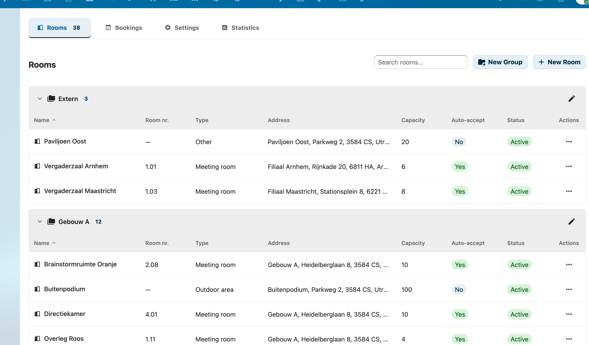

# Administrator Guide

This guide describes day-to-day administration of RoomVox. For installation, see the [Installation Guide](../deployment/installation.md).

## Overview

RoomVox is a CalDAV-native room booking app. Rooms appear as bookable resources in any calendar app — Nextcloud Calendar, Apple Calendar, Outlook, Thunderbird, eM Client — without a separate booking interface.

As an administrator you control:

- **Rooms** — name, capacity, type, address, facilities, availability rules ([Managing Rooms](room-management.md))
- **Permissions** — who can view, book, and manage each room ([Permissions](permissions.md))
- **Email** — Nextcloud SMTP, per-room SMTP, sender addresses ([Email Configuration](email-configuration.md))
- **Bulk operations** — CSV import/export, MS365 migration ([Import / Export](import-export.md))
- **Optional integrations** — Calendar patch (visual room browser), Exchange sync, Public API for displays/kiosks
- **Settings** — defaults, room types, email toggle, telemetry ([Settings](settings.md))

## Accessing the Admin Panel

1. Click your **user avatar** in the top right
2. Select **Settings** (⚙️)
3. Scroll down the left sidebar to **Administration**
4. Click **RoomVox**

The admin panel has five tabs:

- **Rooms** — CRUD and permissions
- **Bookings** — approve, decline, reschedule, cancel
- **Import / Export** — bulk room management
- **Settings** — defaults, room types, email, API tokens, telemetry
- **Statistics** — usage data

## Day-to-Day Tasks

| Task | Where | Reference |
|---|---|---|
| Create a room | Rooms tab → **+ New Room** | [Managing Rooms](room-management.md#creating-rooms) |
| Set who can book a room | Rooms tab → permissions icon | [Permissions](permissions.md) |
| Approve a pending booking | Bookings tab → filter **Pending** | [Managing Bookings](../user/managing-bookings.md#approving-bookings) |
| Add/edit room types | Settings tab → **Room Types** | [Settings](settings.md) |
| Bulk import rooms from MS365 | Import / Export tab → drag CSV | [Import / Export](import-export.md) |
| Create an API token | Settings tab → **API Tokens** | [Public API](../features/public-api.md) |
| Disable telemetry | Settings tab → **Support** → toggle off | [Telemetry](telemetry.md) |

## Bookings and Approval

Each room has an **auto-accept** setting:

- **Auto-accept on** — bookings are confirmed immediately if there's no conflict
- **Auto-accept off** — bookings arrive as **Tentative**; a Manager must approve

Pending bookings appear in the Bookings tab. Managers receive an email when a new pending booking arrives. See the [Approval Workflow](../features/approval-workflow.md) feature page for the full flow.

## How Effective Permissions Work

Permissions are stored at two levels:

1. **Room-level** — entries on a specific room
2. **Room group level** — entries on a room group, inherited by all member rooms

Effective permissions are the **union** of both levels. Nextcloud administrators always have full access regardless of explicit permissions.

If a room has **no permissions configured** (and no group permissions apply), all authenticated users can book it — only Nextcloud admins can manage. Once you configure any permission, only the listed users/groups have access. See [Permissions](permissions.md).

## Email Notifications

RoomVox sends nine notification types — booking confirmed, declined, conflict, horizon exceeded, outside availability, approval request, cancellation, and others. See [Email Notifications](../features/email-notifications.md) for the full matrix.

Requirements:

- **Nextcloud SMTP** configured in Settings → Administration → Basic settings → Email server
- **Email notifications enabled** in RoomVox Settings tab
- **Users have email addresses** in their Nextcloud profile
- **`occ config:app:set dav sendInvitations --value yes`** for iMIP invitations to external attendees

See [Email Configuration](email-configuration.md) for SMTP details and per-room SMTP setup.

## Per-Room SMTP

Each room can have its own SMTP server, so notifications appear to come from the room's own mailbox. Passwords are encrypted via Nextcloud's `ICrypto`. See [Email Configuration → Per-Room SMTP](email-configuration.md#per-room-smtp-optional).

## Optional: Calendar Patch

The optional [Calendar Patch](../features/calendar-patch.md) replaces Nextcloud Calendar's minimal resource picker with a full room browser — grouping by building, real-time availability, multi-filter chips, search by name/address/floor. Deploy with `./deploy-calendar.sh <target>`.

## Optional: Public API

The [Public API](../features/public-api.md) provides Bearer-token authenticated REST endpoints for external integrations (room displays, kiosks, digital signage). Three scopes: `read`, `book`, `admin`. Tokens can be scoped to specific rooms.

## Next Steps

- [Settings reference](settings.md) — every admin option in detail
- [Managing Rooms](room-management.md) — full CRUD walkthrough
- [Permissions](permissions.md) — roles, inheritance, CalDAV visibility
- [Best Practices](best-practices.md) — recommended patterns
- [Troubleshooting](troubleshooting.md) — common issues
- [FAQ](faq.md) — frequently asked questions
