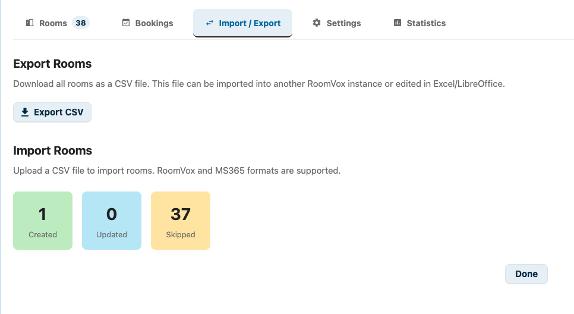
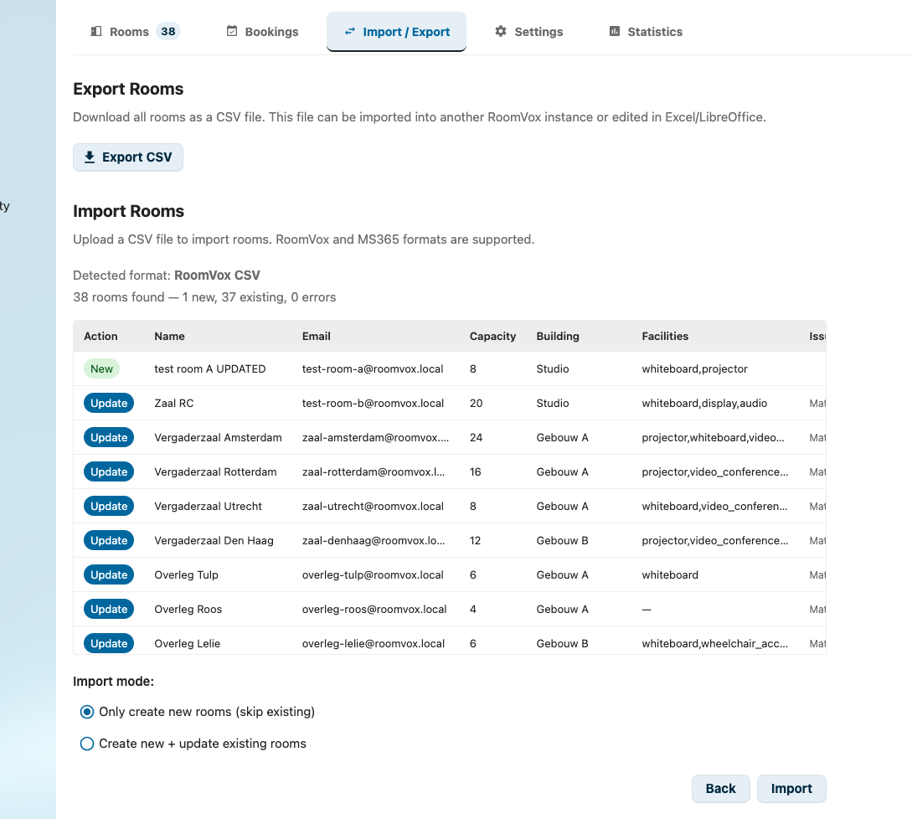
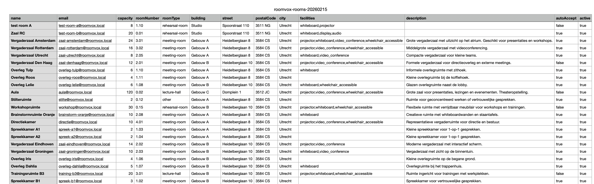

# Import / export

RoomVox ondersteunt bulk-ruimtebeheer via CSV-bestanden. Je kunt alle ruimtes exporteren voor back-up of migratie, en ruimtes importeren uit CSV-bestanden — inclusief bestanden die geëxporteerd zijn uit Microsoft 365 / Exchange.

## Export

### Alle ruimtes exporteren

1. Ga naar **Instellingen > Beheer > RoomVox**
2. Klik op het tabblad **Import / Export**
3. Klik op **Export CSV**



Er wordt een CSV-bestand gedownload met alle ruimtes en 13 kolommen:

| Kolom | Voorbeeld |
|--------|---------|
| `name` | Meeting Room 1 |
| `email` | room1@company.com |
| `capacity` | 12 |
| `roomNumber` | 2.17 |
| `roomType` | meeting-room |
| `building` | Building A |
| `street` | Heidelberglaan 8 |
| `postalCode` | 3584 CS |
| `city` | Utrecht |
| `facilities` | projector,whiteboard,video-conference |
| `description` | Grote vergaderruimte op de 2e verdieping |
| `autoAccept` | true |
| `active` | true |

Dit bestand kan:
- Geïmporteerd worden in een andere RoomVox-instantie
- Bewerkt worden in Excel of LibreOffice Calc
- Gebruikt worden als back-up

### Voorbeeld-CSV downloaden

Klik op **Download sample CSV** om een sjabloonbestand te krijgen met kopregels en één voorbeeldrij. Gebruik dit als startpunt wanneer je ruimtes vanaf nul aanmaakt.

## Import

### Ondersteunde formaten

RoomVox detecteert het CSV-formaat automatisch:

**RoomVox-formaat** — Bestanden die uit RoomVox geëxporteerd zijn of handmatig gemaakt zijn met de hierboven genoemde kolomnamen.

**MS365/Exchange-formaat** — Bestanden die via PowerShell geëxporteerd zijn. Gebruik een van de twee onderstaande opties.

**Optie 1 — alleen place-data (geen e-mailadressen):**

```powershell
Get-Place -ResultSize Unlimited | Export-Csv -Path rooms.csv -NoTypeInformation
```

Dit exporteert ruimte-metadata (gebouw, verdieping, plaats, capaciteit, enzovoort) maar **niet** het e-mailadres. Ruimtes worden tijdens de import gematcht op naam.

**Optie 2 — volledige export met e-mailadressen (aanbevolen):**

```powershell
$rooms = Get-EXOMailbox -RecipientTypeDetails RoomMailbox -ResultSize Unlimited
$rooms | ForEach-Object {
    $mailbox = $_
    $place = Get-Place -Identity $mailbox.PrimarySmtpAddress -ErrorAction SilentlyContinue
    [PSCustomObject]@{
        DisplayName            = $mailbox.DisplayName
        PrimarySmtpAddress     = $mailbox.PrimarySmtpAddress
        ResourceCapacity       = $mailbox.ResourceCapacity
        Building               = $place.Building
        Floor                  = $place.Floor
        FloorLabel             = $place.FloorLabel
        Street                 = $place.Street
        PostalCode             = $place.PostalCode
        City                   = $place.City
        Capacity               = $place.Capacity
        Tags                   = ($place.Tags -join ',')
        IsWheelChairAccessible = $place.IsWheelChairAccessible
        AudioDeviceName        = $place.AudioDeviceName
        VideoDeviceName        = $place.VideoDeviceName
        DisplayDeviceName      = $place.DisplayDeviceName
        Nickname               = $place.Nickname
        BookingType            = $place.BookingType
    }
} | Export-Csv -Path rooms.csv -NoTypeInformation
```

Dit script voegt `Get-EXOMailbox` (met het e-mailadres) samen met `Get-Place` (met locatie- en apparatuur-data) tot één CSV. Het e-mailadres maakt betrouwbare duplicaat-detectie tijdens de import mogelijk.

> **Let op:** de simpele pipeline `Get-EXOMailbox | Get-Place | Export-Csv` behoudt **geen** e-mailadressen — `Get-Place` geeft een ander objecttype terug waarin het veld `PrimarySmtpAddress` ontbreekt.

MS365-kolommen worden automatisch gemapt op RoomVox-velden:

| MS365-kolom | RoomVox-veld | Opmerkingen |
|--------------|---------------|-------|
| `DisplayName` | name | |
| `PrimarySmtpAddress` / `EmailAddress` | email | Vereist optie 2 |
| `Capacity` / `ResourceCapacity` | capacity | |
| `Floor` / `FloorLabel` | roomNumber | |
| `Building` | building (adres) | |
| `Street` | street (adres) | |
| `PostalCode` | postalCode (adres) | |
| `City` | city (adres) | |
| `Tags` | facilities | Komma-gescheiden |
| `IsWheelChairAccessible` | faciliteit wheelchair | `true` voegt wheelchair toe |
| `AudioDeviceName` | faciliteit audio | Niet-leeg voegt audio toe |
| `VideoDeviceName` | faciliteit videoconf | Niet-leeg voegt videoconf toe |
| `DisplayDeviceName` | faciliteit display | Niet-leeg voegt display toe |
| `Nickname` | description | |
| `BookingType` | autoAccept | `Standard` = auto-accept aan |

### Import-stappen

1. Ga naar het tabblad **Import / Export**
2. Sleep een CSV-bestand erin, of klik op **Bestand kiezen**
3. RoomVox toont een **preview** met:
   - Gedetecteerd formaat (RoomVox of MS365)
   - Aantal gevonden ruimtes
   - Actie per rij: **Nieuw** (wordt aangemaakt) of **Update** (matcht een bestaande ruimte)
   - Eventuele validatie-fouten



4. Kies een import-modus:
   - **Alleen nieuwe ruimtes aanmaken** — sla rijen over die matchen met bestaande ruimtes
   - **Nieuwe aanmaken + bestaande updaten** — maak nieuwe ruimtes aan en werk bestaande bij
5. Voor MS365-imports met e-mailadressen: schakel eventueel **Exchange-agenda-sync** in om elke ruimte automatisch te koppelen aan zijn MS365-mailbox voor tweerichtings-agenda-synchronisatie. Dit vereist dat Exchange-sync in de globale instellingen is geconfigureerd.
6. Klik op **Import**
7. Bekijk de resultaten: aangemaakt, bijgewerkt, overgeslagen en fouten


### Duplicaat-detectie

RoomVox detecteert duplicaten door te vergelijken op:

1. **E-mailadres** (primaire match) — als het e-mailadres uit de CSV matcht met het e-mailadres van een bestaande ruimte
2. **Ruimte-naam** (secundaire match) — als de naam uit de CSV matcht met de naam van een bestaande ruimte

Gematchte ruimtes worden in de preview als "Update" getoond. In de modus alleen-aanmaken worden deze rijen overgeslagen.

### Validatie

De import valideert elke rij voordat hij verwerkt wordt:

- **Name** is verplicht — rijen zonder naam worden geweigerd
- **Capacity** moet een getal zijn als het ingevuld is
- **Email** moet een geldig e-mailadres zijn als het ingevuld is
- **Dubbele namen** binnen de CSV zelf worden gemarkeerd

### Faciliteiten

De kolom facilities accepteert komma-gescheiden waarden. Bekende faciliteiten worden automatisch genormaliseerd:

| Invoer | Genormaliseerd |
|-------|-----------|
| `projector`, `beamer` | projector |
| `whiteboard` | whiteboard |
| `video-conference`, `videoconf` | video-conference |
| `audio-system` | audio-system |
| `display-screen`, `screen` | display-screen |
| `wheelchair-accessible`, `wheelchair` | wheelchair-accessible |

### Scheidingsteken-detectie

RoomVox detecteert het CSV-scheidingsteken automatisch. Komma (`,`), puntkomma (`;`) en tab-gescheiden bestanden worden allemaal ondersteund. Dat betekent dat bestanden die opgeslagen zijn door de Nederlandse of Duitse versie van Excel (die `;` gebruiken) werken zonder handmatige conversie.

### Maximale bestandsgrootte

Geüploade CSV-bestanden zijn beperkt tot **5 MB**. Splits het bestand in meerdere delen voor grotere imports.

### Tips

- Exporteer eerst je huidige ruimtes om het exacte formaat te zien
- Bewerk de geëxporteerde CSV in Excel/LibreOffice en importeer daarna opnieuw met de modus "aanmaken + updaten"
- Gebruik voor MS365-migraties het volledige export-script (optie 2) om e-mailadressen te behouden en de meest complete data te krijgen
- De import verwerkt UTF-8 BOM (byte order mark) automatisch

### Geëxporteerde CSV in Excel

De geëxporteerde CSV kan direct in Excel of LibreOffice Calc geopend worden om te bewerken.


