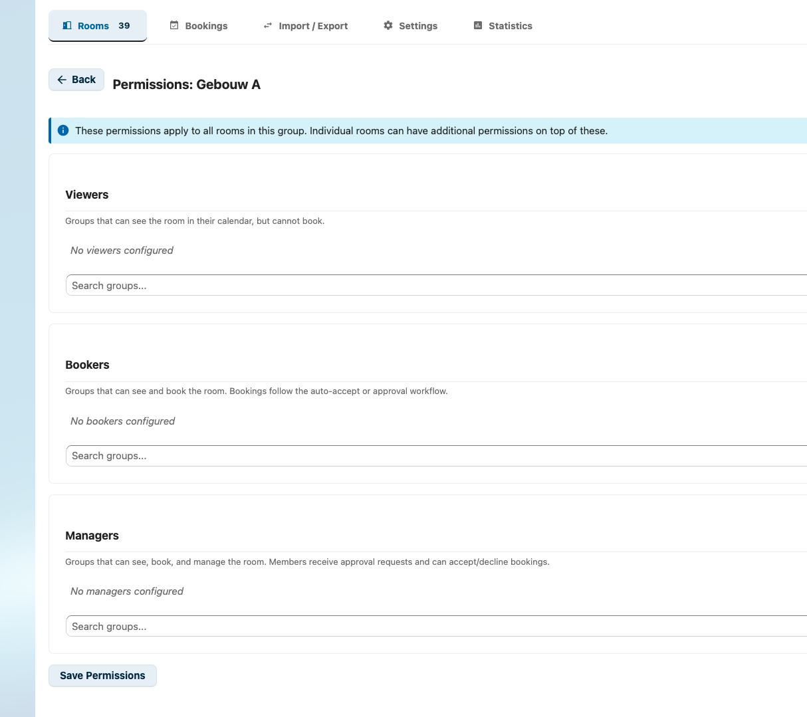
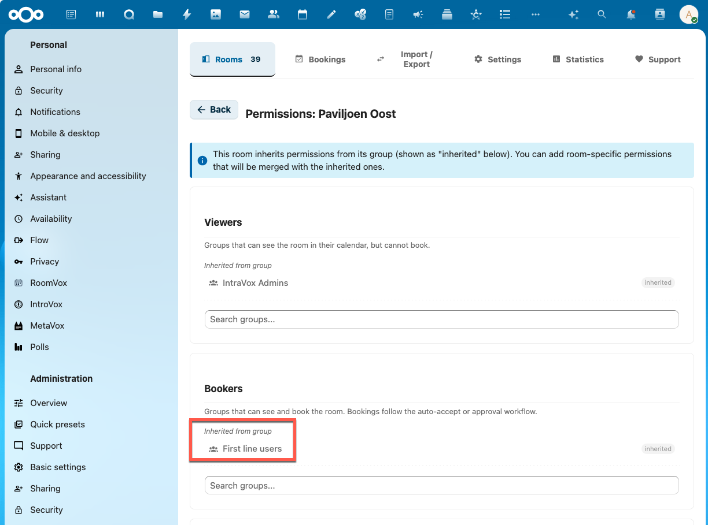

# Permissions

RoomVox uses its own role-based permission system to control who can view, book, and manage rooms. This system is **separate from Nextcloud Calendar's sharing permissions** — sharing or unsharing a calendar in Nextcloud has no effect on room access in RoomVox.

> **Important:** Without any permissions configured, all authenticated users can book all rooms. If you want to restrict access, you must configure permissions in RoomVox — Nextcloud's calendar sharing settings will not apply. See [Default Permissions](#default-permissions) below.

## Roles

There are three roles, each inheriting the capabilities of the previous:

| Role | Can View | Can Book | Can Manage |
|------|----------|----------|------------|
| Viewer | Yes | No | No |
| Booker | Yes | Yes | No |
| Manager | Yes | Yes | Yes |

### Viewer

- Can see the room in calendar apps (via CalDAV resource listing)
- Sees the room in **Settings → Personal → RoomVox → My Rooms** with its Responsible contact value, so they know who to ask when they cannot book it themselves
- Cannot create bookings

### Booker

- Can see the room in calendar apps
- Can create bookings (add room to events)
- Can cancel their own bookings
- Sees the room (with Responsible contact) under Settings → Personal → RoomVox → My Rooms

### Manager

- Can see the room in calendar apps
- Can create bookings
- Can approve or decline pending bookings
- Can cancel any booking for the room (the booker is notified by email and the room is removed from their calendar event)
- Can edit room settings and permissions
- Receives email notifications for new pending bookings
- Gets a **Bookings** tab under Settings → Personal → RoomVox showing the same overview admins see, scoped to the rooms they manage (stats, filters, list/calendar toggle, drag-and-drop move between rooms)

## Permission Entries

Permissions can be assigned to individual users or Nextcloud groups.

### User Permissions

Assign a role directly to a specific Nextcloud user:

```
{
  "type": "user",
  "id": "alice"
}
```

### Group Permissions

Assign a role to an entire Nextcloud group — all members of the group inherit the permission:

```
{
  "type": "group",
  "id": "developers"
}
```

## Setting Permissions

### Room-Level Permissions

1. In the room list, click the **permissions icon** for the room
2. The permission editor opens with three sections: Viewers, Bookers, Managers
3. Search for users or groups to add
4. Click **Save**

### Group-Level Permissions

Permissions set on a room group are inherited by all rooms in that group.

1. In the room groups section, click the **permissions icon** for the group
2. Add viewers, bookers, and managers using the search fields
3. Click **Save Permissions**



### How Inheritance Works

A room's effective permissions are the **union** of:
- Its own room-level permissions
- The permissions of its assigned room group (if any)

**Example:**

```
Room Group "Building A":
  - bookers: [group: "staff"]

Room "Meeting Room 1" (in Building A):
  - managers: [user: "bob"]
  - bookers: [user: "alice"]

Effective permissions for "Meeting Room 1":
  - managers: [user: "bob"]
  - bookers: [user: "alice", group: "staff"]  ← merged
```

### Viewing Inherited Permissions

When editing permissions for a room that belongs to a group, the permission editor shows both:

- **Inherited permissions** — from the room group, displayed as greyed-out entries with an "inherited" badge. These cannot be removed from the room editor; edit the group permissions to change them.
- **Room-specific permissions** — additional entries that apply only to this room. These can be added and removed freely.

This makes it easy to see the full picture of who has access to a room without switching between the room and group editors.



## Default Permissions

If no permissions are configured for a room (and no group permissions apply):

- **All authenticated users** can view and book the room
- Only **Nextcloud administrators** can manage it

Once any permission is configured, only the specified users/groups have access.

## Nextcloud Admin Bypass

Users in the Nextcloud **admin** group always have full access to all rooms, regardless of permission settings. They can:

- View all rooms
- Book any room
- Manage any room (approve/decline, edit, delete)

## CalDAV Visibility

Permissions also control which rooms are visible in calendar apps:

- **Group entries** in permissions are used as CalDAV `group_restrictions`
- Nextcloud Calendar only shows rooms to users who belong to at least one of the restricted groups
- **User entries** are enforced at booking time by the scheduling plugin, not at the CalDAV visibility level

This means:
- A user added as an individual Booker may need to search for the room by name rather than browsing
- A group added as Booker will see the room appear automatically in the resource list

> **Note:** Permission changes are synced to Nextcloud's room cache immediately. After saving permissions, updated room visibility takes effect the next time a user opens the Room Finder or refreshes their calendar.

## Permission Checks in Practice

### Viewing Rooms in Admin Panel

The admin panel shows rooms filtered by the user's effective permissions. Non-admin users only see rooms where they have at least Viewer access.

### Booking via CalDAV

When a user adds a room to a calendar event:

1. The scheduling plugin resolves the sender's email/principal to a Nextcloud user ID
2. It checks the user's `canBook()` permission for the room
3. If the user lacks permission:
   - The booking is declined with status `3.7`
   - The room attendee is **removed** from the organizer's event
   - The event's **LOCATION** is cleared
   - The organizer receives a **"Booking not permitted"** email explaining they do not have permission to book the room

### Managing Bookings

The admin panel's booking overview shows bookings across all rooms the user has Manager access to. Approve/decline actions require Manager role.

## Best Practices

1. **Use groups** for common access patterns — easier to maintain than individual user permissions
2. **Use room groups** for buildings or departments — set shared permissions once
3. **Assign at least one manager** per room for approval workflows
4. **Keep Viewer permissions broad** — let users see room availability even if they can't book
5. **Review permissions periodically** — remove departing users and update group memberships
