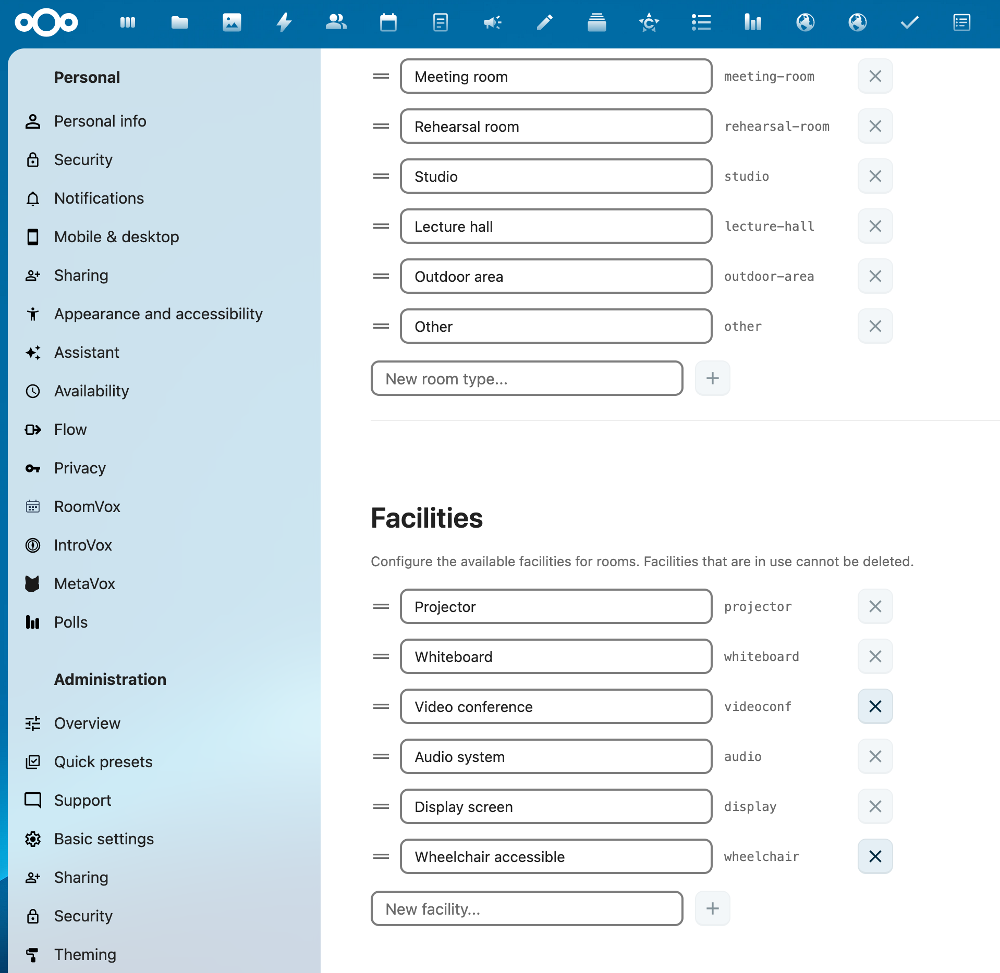
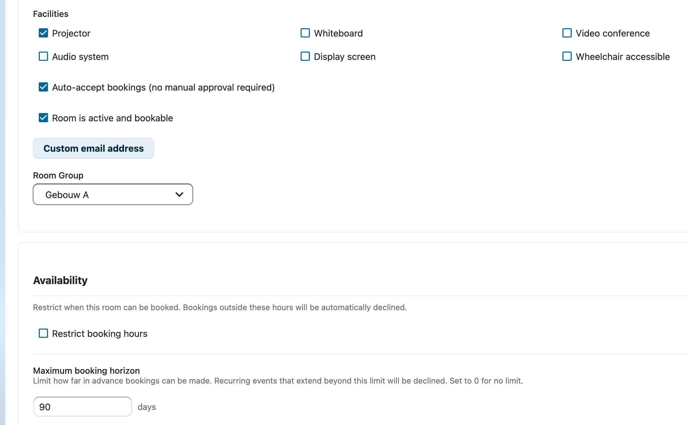

# Ruimte-beheer

Deze gids behandelt het aanmaken, configureren en organiseren van ruimtes in RoomVox.

## Ruimte-overzicht

Het beheerpaneel heeft vijf tabs: **Ruimtes**, **Boekingen**, **Import / Export**, **Instellingen** en **Statistieken**. De Ruimtes-tab toont alle ruimtes georganiseerd per groep, met kolommen voor naam, ruimte-nummer, type, adres, capaciteit, auto-accept-status en actieve status.

## Ruimtes aanmaken

1. Ga naar **Instellingen > Beheer > RoomVox**
2. Klik op de tab **Ruimtes**
3. Klik op **+ Nieuwe ruimte**
4. Vul de ruimte-gegevens in en klik op **Ruimte aanmaken**

### Ruimte-eigenschappen

| Veld | Verplicht | Omschrijving |
|-------|----------|-------------|
| Naam | Ja | Weergavenaam die in agenda-apps getoond wordt (bijv. "Vergaderruimte 1") |
| Ruimte-nummer | Nee | Gebouw-/verdiepings-aanduiding (bijv. "2.17" voor verdieping 2, ruimte 17) |
| Capaciteit | Nee | Maximum aantal personen |
| Ruimte-type | Nee | Categorie uit de geconfigureerde types (vergaderruimte, studio, etc.) |
| Adres | Nee | Gebouwnaam, straat en plaats — wordt getoond als locatie. Opgeslagen als een 4-delige komma-gescheiden string (`Building, Street, Postal code, City`), waarbij lege delen behouden blijven zodat gedeeltelijke adressen correct heen en weer gaan |
| Omschrijving | Nee | Aanvullende informatie over de ruimte (alleen voor admin/manager) |
| Verantwoordelijke contactpersoon | Nee | Vrije tekst met contactgegevens (bijv. `Anne Janssen (anne@voxcloud.nl)` of `Vraag de gebouwbeheerder`). Zichtbaar voor elke gebruiker met kijk-permissie in Instellingen → Persoonlijk → RoomVox → Mijn ruimtes, zodat viewers weten bij wie ze moeten zijn wanneer ze een ruimte niet zelf kunnen boeken. Max 255 tekens |
| Faciliteiten | Nee | Aanwezige apparatuur (beamer, whiteboard, videoconferencing, etc.) |
| E-mail | Nee | Eigen e-mailadres voor de ruimte (zie hieronder) |
| Ruimte-groep | Nee | Wijs de ruimte toe aan een groep voor gedeelde permissies |

### E-mailadres van de ruimte

Elke ruimte heeft een e-mailadres dat voor twee doelen gebruikt wordt:

1. **CalDAV-scheduling** — het adres dat gebruikt wordt wanneer de ruimte als deelnemer wordt toegevoegd. Als er geen eigen e-mailadres is ingesteld, genereert RoomVox een intern adres (`<room-id>@roomvox.local`).

2. **Afzender van notificaties** — als de ruimte een echt extern e-mailadres heeft (bijv. `room1@company.com`), worden notificaties vanaf dat adres verstuurd. Interne `@roomvox.local`-adressen vallen terug op de systeem-afzender van Nextcloud.

### Faciliteiten

Beschikbare faciliteit-checkboxes:

- Beamer
- Whiteboard
- Videoconferencing
- Audiosysteem
- Display/scherm
- Rolstoeltoegankelijk

Deze worden gepubliceerd als CalDAV-ruimte-features en kunnen gebruikt worden om te filteren in de ruimte-browser van de calendar-patch.

## Boekings-gedrag

### Auto-accept

Wanneer ingeschakeld worden boekingen automatisch bevestigd als er geen conflicten zijn. Wanneer uitgeschakeld worden boekingen op voorlopig (in afwachting) gezet en is manager-goedkeuring vereist.

Configureer dit per ruimte, of stel de standaardwaarde in via Instellingen > Standaard auto-accept.

### Beschikbaarheids-regels

Beperk wanneer ruimtes geboekt kunnen worden:

1. Schakel in de ruimte-editor **Boekingsuren beperken** in
2. Voeg een of meer regels toe:
   - **Dagen** — selecteer welke dagen van de week (maandag tot en met zondag)
   - **Van/Tot** — tijdvenster voor elke dag
3. Gebruik presets voor veelvoorkomende patronen:
   - **Werkdagen 08–18** — maandag tot en met vrijdag, 08:00 tot 18:00 uur
   - **Werkdagen 09–17** — maandag tot en met vrijdag, 09:00 tot 17:00 uur

Boekingen buiten deze regels worden automatisch afgewezen.

### Weekenden tonen/verbergen

Bepaal of weekenden zichtbaar zijn in de boekings-agenda:

1. Ga naar **Instellingen > Beheer > RoomVox**
2. Klik op de tab **Instellingen**
3. Zet **Weekenden tonen in agenda** aan of uit

Deze instelling beïnvloedt alleen de weergave van de agenda. Om boekingen in het weekend te voorkomen gebruik je in plaats daarvan beschikbaarheids-regels met alleen werkdagen.

### Maximale boekings-horizon

Beperk hoe ver vooruit ruimtes geboekt kunnen worden:

- Stel het aantal dagen in (bijv. 90 = maximaal 3 maanden vooruit)
- Zet op 0 voor geen limiet
- Terugkerende events worden gecheckt tegen hun laatste voorkomende keer

## Ruimte-status

### Actief / Inactief

Ruimtes kunnen geactiveerd of gedeactiveerd worden:

- **Actief** — ruimte verschijnt als CalDAV-resource en kan geboekt worden
- **Inactief** — ruimte is verborgen voor agenda-apps, maar de configuratie blijft bewaard

Zet de **Actief**-schakelaar om in de ruimte-editor.

### Ruimtes verwijderen

Een ruimte permanent verwijderen:

1. Klik op de knop **Verwijderen** in de ruimte-editor
2. Bevestig de verwijdering

Dit verwijdert:
- De ruimte-configuratie
- De CalDAV-agenda van de ruimte en alle boekingen
- Het service-account van de ruimte
- De ruimte-permissies

## Ruimte-types

Ruimte-types helpen je om je ruimtes te categoriseren. Ze worden getoond in de ruimte-lijst en gepubliceerd als CalDAV-metadata.

### Types beheren

1. Ga naar de tab **Instellingen** in het beheerpaneel
2. Zoek de sectie **Ruimte-types**
3. Voeg types toe, bewerk ze of verwijder ze
4. Sleep om de volgorde te wijzigen

### Standaard-types

- Vergaderruimte
- Repetitieruimte
- Studio
- Collegezaal
- Telefooncel
- Buitenruimte
- Overig

## Ruimte-groepen

Met ruimte-groepen kun je ruimtes organiseren en permissies delen over meerdere ruimtes.

### Een groep aanmaken

1. Klik in de ruimte-lijst op **Groepen beheren**
2. Klik op **Groep toevoegen**
3. Voer een naam en eventueel een omschrijving in
4. Klik op **Opslaan**

### Ruimtes aan groepen toewijzen

Selecteer bij het bewerken van een ruimte een **Ruimte-groep** uit de dropdown. De ruimte erft de permissies van de groep (samengevoegd met zijn eigen permissies op ruimte-niveau).

### Groeps-permissies

Stel permissies op groeps-niveau in om ze op alle ruimtes in de groep toe te passen:

1. Klik op het permissie-icoon bij de groep
2. Voeg viewers, bookers en managers toe via de zoekvelden
3. Klik op **Permissies opslaan**
4. Deze permissies worden samengevoegd (vereniging) met de individuele permissies van elke ruimte

### Groepen verwijderen

Groepen kunnen alleen verwijderd worden wanneer er geen ruimtes aan toegewezen zijn. Verplaats alle ruimtes of hef de toewijzing op voordat je verwijdert.

## SMTP per ruimte

Elke ruimte kan zijn eigen SMTP-server hebben voor het versturen van notificaties. Zie [E-mail-configuratie](email-configuration.md) voor details.

### Configuratie

Klap in de ruimte-editor de sectie **SMTP-configuratie** uit:

| Veld | Omschrijving |
|-------|-------------|
| Host | Hostnaam van de SMTP-server (bijv. `smtp.company.com`) |
| Port | SMTP-poort (standaard: 587) |
| Username | Gebruikersnaam voor SMTP-authenticatie |
| Password | Wachtwoord voor SMTP-authenticatie (versleuteld met ICrypto) |
| Encryption | TLS, SSL of None |

### Testen

Klik op **Testmail versturen** om de SMTP-configuratie te verifiëren. Voer een ontvanger-e-mailadres in en controleer of de testmail aankomt.
