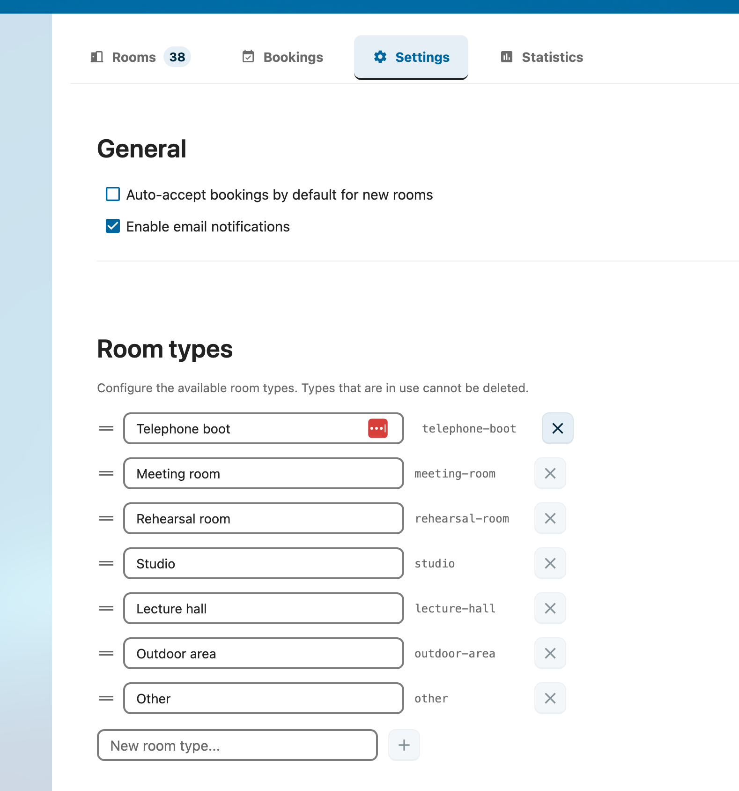

# Admin Settings Reference

Reference for every option in **Settings → Administration → RoomVox**.



## Tabs Overview

| Tab | Purpose |
|---|---|
| Rooms | Room CRUD, permissions, room groups |
| Bookings | Approve/decline, list/calendar view, drag-and-drop move |
| Import / Export | Bulk CSV operations |
| Settings | App-wide defaults — room types, email, telemetry, API tokens |
| Statistics | Usage data |

## General Settings

### Default Auto-Accept

**Function:** Default value for new rooms' auto-accept toggle.

| State | Behavior |
|---|---|
| ✅ Checked | New rooms confirm bookings automatically when there's no conflict |
| ☐ Unchecked | New rooms mark bookings as **Tentative**; a Manager must approve |

Each room can override this in its own editor.

**Storage:** `appconfig` key `defaultAutoAccept` (`'true'` / `'false'`)

### Enable Email Notifications

**Function:** Master switch for all RoomVox email notifications.

When off, RoomVox sends no confirmation/decline/approval/cancellation emails — even if Nextcloud SMTP is configured. Useful during maintenance or initial setup.

**Storage:** `appconfig` key `emailEnabled` (`'true'` / `'false'`)

### Show Weekends in Calendar

**Function:** Controls whether weekend days are visible in the booking calendar view.

This is a **display** setting only — it does not prevent weekend bookings. To restrict bookings to weekdays, use [Availability Rules](../features/availability-rules.md) on individual rooms instead.

## Room Types

**Function:** Define the room types users can pick from when creating a room.

Defaults (English):

- Meeting Room
- Rehearsal Room
- Studio
- Lecture Hall
- Telephone Booth
- Outdoor Area
- Other

You can add, edit, remove, or reorder types via drag handles. Types are published as a CalDAV property (`{http://nextcloud.com/ns}room-type`), allowing calendar apps to filter by type.

**Storage:** `appconfig` key `roomTypes` (JSON array)

## API Tokens

**Function:** Bearer tokens for the [Public API](../features/public-api.md).


### Token Properties

| Field | Description |
|---|---|
| Name | Free-text label (e.g., `Lobby Display`) |
| Scope | `read`, `book`, or `admin` |
| Restrict to rooms | Optional — limit access to specific rooms |
| Expires | Optional expiration date |

### Scopes

| Scope | Allows |
|---|---|
| `read` | List rooms, read bookings, read availability |
| `book` | Above + create bookings |
| `admin` | Above + statistics + admin operations |

Tokens are shown **once** at creation — copy immediately. After creation only the prefix (`rvx_xxxx...`) is shown.

See [Public API](../features/public-api.md) and [API Reference](../architecture/api-reference.md#public-api-v1) for details.

## Exchange Sync (Optional)

Configure Microsoft Graph credentials for bidirectional Exchange sync. See [Exchange Integration](../architecture/exchange-integration.md) for the full architecture.

**Settings:**

| Field | Description |
|---|---|
| Tenant ID | Microsoft Azure tenant ID |
| Client ID | App registration client ID |
| Client Secret | App registration secret |
| Globally enabled | Master switch for Exchange sync across all rooms |
| Inline-sync throttle | Per-room minimum interval between webhook-triggered syncs |
| Inline-sync rate limit | Global rate cap to prevent overload |

Per-room Exchange linking happens in the room editor.

## Support Tab

### Subscription Key (Enterprise)

Configure your VoxCloud subscription key for Enterprise activation. Free tier is fully featured up to the volume limit (no feature gating).

### Telemetry

| Toggle | Effect |
|---|---|
| Send anonymous usage statistics | Enables/disables daily telemetry |
| Send report now | Manually trigger a report |

See [Telemetry](telemetry.md) for the full data inventory and disable instructions.

## Per-Room vs. App-Wide

| Setting | Scope |
|---|---|
| `defaultAutoAccept` | App-wide default; per-room override available |
| `emailEnabled` | App-wide; no per-room override |
| `roomTypes` | App-wide |
| `showWeekendsInCalendar` | App-wide display preference |
| `telemetry_enabled` | App-wide |
| API tokens | App-wide, optionally room-scoped |
| Exchange sync | App-wide credentials + per-room link |

Per-room settings (auto-accept, availability rules, booking horizon, SMTP, Exchange link) live in the room editor — see [Managing Rooms](room-management.md).

## Where Settings Are Stored

All RoomVox settings live in Nextcloud's `oc_appconfig` table (key-value, no custom tables). Inspect with:

```bash
sudo -u www-data php occ config:app:get roomvox defaultAutoAccept
sudo -u www-data php occ config:app:get roomvox emailEnabled
sudo -u www-data php occ config:app:get roomvox roomTypes
sudo -u www-data php occ config:app:get roomvox rooms_index
sudo -u www-data php occ config:app:get roomvox room/<roomId>
```

See [Backend Architecture](../architecture/backend-architecture.md) for the full storage model.

## See Also

- [Admin Guide](guide.md) — day-to-day administration
- [Managing Rooms](room-management.md) — per-room configuration
- [Public API](../features/public-api.md) — API token usage
- [Telemetry](telemetry.md) — data collected
