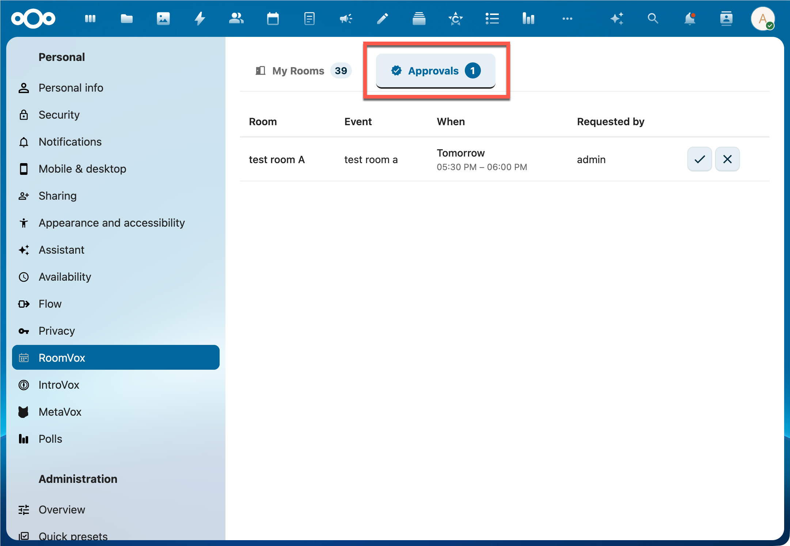

# Approval Workflow

Each room in RoomVox has an **auto-accept** setting. When auto-accept is off, bookings arrive as **Tentative** and require manager approval before they become confirmed.



## When to Use Auto-Accept vs. Approval

| Mode | Best for |
|---|---|
| **Auto-accept on** | High-trust environments, ample room capacity, fast iteration matters |
| **Auto-accept off** (approval required) | High-demand rooms, formal venues (boardroom, lecture hall), need human judgment on each booking |

You can set the default app-wide in **Settings → Default auto-accept**, and override per room in the room editor.

## The Approval Flow

```
User adds room to event
    │
    ├─ RoomVox checks: permission? available? within rules?
    │
    │  If any check fails → DECLINED (auto, with email explanation)
    │
    │  Otherwise:
    │
    ├─ autoAccept = true  →  ACCEPTED
    │                         └─ Confirmation email to organizer
    │
    └─ autoAccept = false →  TENTATIVE
                              ├─ Approval-request email to all managers
                              ├─ Booking shown in admin Bookings tab (status Pending)
                              └─ Shown in Personal Settings → Approvals tab (for managers)
                                  │
                                  ├─ Manager clicks Approve → ACCEPTED
                                  │   └─ Confirmation email to organizer
                                  │
                                  └─ Manager clicks Decline → DECLINED
                                      └─ Decline email to organizer
```

## What Managers See

Managers can act on pending bookings in two places:

### Settings → Personal → RoomVox → Approvals

Shows pending bookings for rooms the user manages — with event title, room, organizer, requested time, and Approve/Decline buttons. This tab only appears for users with Manager role on at least one room.

### Settings → Administration → RoomVox → Bookings (admins)

The full Bookings tab. Filter by **Status: Pending** to see only bookings awaiting approval.

Managers receive an **email** when a new pending booking arrives, so they don't need to keep these tabs open.

## What Organizers Get

When a booking is set to Tentative, the calendar app shows the room as Tentative (typically as a striped/dimmed entry). The organizer:

- Sees the room as Tentative in their calendar app
- Does **not** receive an immediate confirmation email (no "Confirmed" until the manager approves)
- Receives a confirmation email when the manager approves
- Receives a decline email if the manager declines, with the reason (if the manager provided one)

## Manager-Cancelled Bookings

A new manager can also cancel an **already-accepted** booking via the **Cancel booking** button in the Bookings tab. Since v1.1.0, this flow:

1. Removes the booking from the room calendar
2. Removes the room attendee from the booker's own event
3. Clears the `LOCATION` field on the booker's event
4. Sends a "Booking cancelled by manager" email to the booker explaining the booking was pulled

This is distinct from the user cancelling their own booking — see [Managing Bookings](../user/managing-bookings.md#cancelling-bookings).

## Edge Cases

### Recurring Events

The approval is **per-series**, not per-occurrence. Approving a recurring booking confirms the entire series. To handle individual occurrences differently, the manager would need to cancel a single instance afterwards — see [FAQ](../user/faq.md#can-i-cancel-just-one-occurrence-of-a-recurring-booking).

### API-Created Bookings (v1.1.1+)

Bookings created via REST API endpoints (both internal and Public API v1) on rooms with `autoAccept=false` now correctly trigger manager-approval emails. Earlier versions wrote directly to the room calendar without traversing the Sabre scheduling plugin, skipping the notification hook. This was fixed in v1.1.1 ([#14](https://github.com/nextcloud/RoomVox/issues/14)).

### Booking Created by a Manager

When a manager creates a booking directly from the admin panel ("Create booking" button), the booking is auto-confirmed if the manager has booking permission — no separate approval step. The created booking goes through the same conflict check.

### Room Sync in Progress

When a room is linked to Exchange for the first time, RoomVox runs an initial full sync (`-30d` to `+365d`). During this sync, **all new bookings are temporarily declined** with schedule status `5.3` and the organizer gets a "Room sync in progress" email asking to retry. This prevents double-bookings while RoomVox hasn't yet seen all Exchange events. See [Exchange Integration](../architecture/exchange-integration.md).

## Required Permissions to Approve

| Action | Required Role |
|---|---|
| Approve / decline pending bookings | Manager (on the specific room) or Nextcloud Admin |
| Cancel an accepted booking | Manager, Organizer, or Nextcloud Admin |
| Edit a booking | Manager, Organizer, or Nextcloud Admin |

## See Also

- [Email Notifications](email-notifications.md) — all email types and triggers
- [Permissions](../admin/permissions.md) — three-role system
- [Managing Bookings](../user/managing-bookings.md) — user-facing approval and cancellation
- [Personal Settings](../user/personal-settings.md) — Approvals and Bookings tabs
