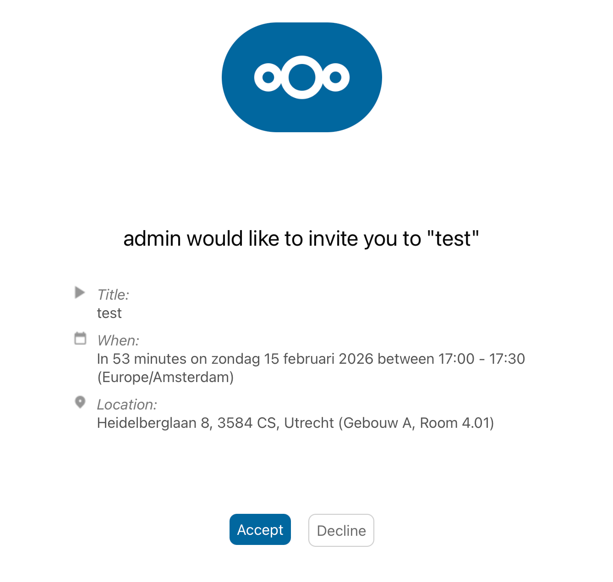
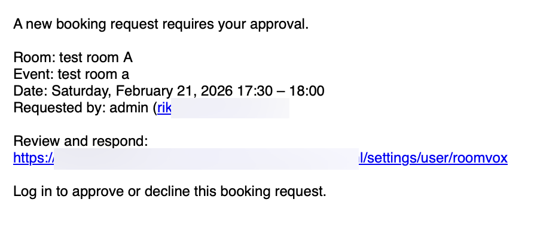

# Email Notifications

RoomVox sends nine types of email notification covering the full booking lifecycle. This page describes each type, who receives it, when it fires, and what the email contains.

For SMTP setup and per-room sender configuration, see [Email Configuration](../admin/email-configuration.md).

## Prerequisites

- **Email notifications enabled** — Settings → Administration → RoomVox → Settings → "Enable email notifications"
- **Nextcloud SMTP configured** — Settings → Administration → Basic settings → Email server
- **Users have email addresses** — required for both organizer and managers
- **`occ config:app:set dav sendInvitations --value yes`** — for iMIP invitations to external attendees

## The Nine Notification Types

| # | Notification | Sent to | Trigger |
|---|---|---|---|
| 1 | Booking confirmed | Organizer | Auto-accept, or manager approval |
| 2 | Approval request | All room managers | New booking on a non-auto-accept room |
| 3 | Booking declined | Organizer | Manager declined a pending booking |
| 4 | Permission denied | Organizer | User lacks Booker role for the room |
| 5 | Scheduling conflict | Organizer | Time overlaps with an existing booking |
| 6 | Booking horizon exceeded | Organizer | Event beyond the room's max horizon |
| 7 | Outside availability hours | Organizer | Event outside the room's available days/times |
| 8 | Room sync in progress | Organizer | Booking arrived during initial Exchange sync |
| 9 | Booking cancelled | Organizer + managers | Organizer cancels (iTIP CANCEL) |
| 10 | Booking cancelled by manager | Organizer | Manager pulled an already-accepted booking |

(Yes, the count is technically ten — "cancelled by manager" was split from "cancelled" in v1.1.0 to clarify who initiated the action.)

## 1. Booking Confirmed

**Sent to:** Organizer

Triggered when a booking is accepted — either auto-accepted by the room or manually approved by a manager.

**Contains:**
- Room name
- Event summary
- Event date and time
- Organizer name and email
- iCalendar `REPLY` attachment so the calendar app can update the event status automatically

## 2. Approval Request

**Sent to:** All room managers

Triggered when a new booking arrives on a room with `autoAccept=false`. The booking is set to **Tentative** status.

**Contains:**
- Room name
- Event summary
- Event date and time
- Organizer name and email
- Link to the admin Bookings tab (or Personal Settings → Approvals for non-admin managers)

## 3. Booking Declined

**Sent to:** Organizer

Triggered when a manager declines a pending booking.

**Contains:**
- Room name, event summary, date and time
- Reason for decline (if the manager provided one)
- iCalendar `REPLY` attachment

## 4. Permission Denied

**Sent to:** Organizer

Triggered when a booking is **automatically** declined because the user does not have permission to book the room.

In addition to sending the email, RoomVox:
- Removes the room from the organizer's event
- Clears the `LOCATION` field

So the calendar event no longer shows the room as part of the meeting.

**Contains:**
- Room name, event summary, date and time
- Explanation that the user does not have permission

## 5. Scheduling Conflict

**Sent to:** Organizer

Triggered when a booking is auto-declined because of a time overlap with an existing booking. Conflict checking expands recurring events since v1.1.0 — booking the second instance of a weekly series now correctly triggers a conflict email.

**Contains:**
- Room name, event summary, requested date and time
- Conflict information

## 6. Booking Horizon Exceeded

**Sent to:** Organizer

Triggered when a booking falls beyond the room's `Maximum booking horizon`. Recurring events with a far-future last occurrence (or no `UNTIL` / `COUNT`) are included.

**Contains:**
- Room name, event summary, requested date and time
- The exact horizon (e.g., `60 days`)
- The earliest date that is no longer bookable (`today + N days`), so the organizer can reschedule without guessing

## 7. Outside Availability Hours

**Sent to:** Organizer

Triggered when a booking falls outside the room's availability rules (e.g., weekday 09:00–17:00).

**Contains:**
- Room name, event summary, requested date and time
- A summary of the room's availability rules (`Mon, Tue, Wed, Thu, Fri 09:00–17:00`)

## 8. Room Sync In Progress

**Sent to:** Organizer

A **temporary failure**: triggered when a booking arrives while a room's initial Exchange sync is still running.

**Contains:**
- Explanation that the room is temporarily unavailable while syncing
- Suggestion to retry in a few minutes

This prevents double-bookings during the initial Exchange import. See [Exchange Integration](../architecture/exchange-integration.md).

## 9. Booking Cancelled

**Sent to:** Organizer and all room managers

Triggered when the organizer cancels their own booking by sending an iTIP `CANCEL` from their calendar app.

**Contains:**
- Room name, event summary, date and time
- Cancellation information
- iCalendar `CANCEL` attachment

## 10. Booking Cancelled by Manager (v1.1.0+)

**Sent to:** Organizer (booker)

Triggered when an admin or manager cancels an **already-accepted** booking via the **Cancel booking** action in the admin Bookings tab or per-booking modal.

This is **distinct** from #9 above — the booker initiated nothing; a manager pulled the room. RoomVox also:
- Removes the room attendee from the booker's own calendar event
- Clears the `LOCATION` field

So the slot frees up in the Room Finder immediately and the booker is not surprised by a calendar entry that points at an unavailable room.

**Contains:**
- Room name, event summary, date and time
- Explanation that the booking was cancelled by a room manager and the room has been released

## iCalendar Attachments

Notification emails include iCalendar (`.ics`) attachments where applicable:

- **REPLY** attachments for accept/decline responses
- **CANCEL** attachments for cancellation notices

Calendar apps automatically update the event status when they read these attachments.

## Email Sender Address

The `From` address on notification emails depends on the room's configuration:

| Configuration | From address |
|---|---|
| Room has a custom external email (`boardroom@company.com`) | Room email |
| Room has per-room SMTP configured | SMTP username (envelope sender), room email as Reply-To |
| Room uses auto-generated `<id>@roomvox.local` | Nextcloud system sender |
| No room email configured | Nextcloud system sender |

See [Email Configuration](../admin/email-configuration.md) for details.

## When Notifications Are Sent (Summary)

| Event | Organizer gets | Managers get |
|---|---|---|
| Booking auto-accepted | Confirmation | — |
| Booking pending approval | — | Approval request |
| Manager approves | Confirmation | — |
| Manager declines | Decline | — |
| Permission denied (auto-decline) | Permission denied | — |
| Scheduling conflict (auto-decline) | Conflict | — |
| Booking horizon exceeded (auto-decline) | Horizon-exceeded (with N days + cutoff date) | — |
| Outside availability hours (auto-decline) | Availability (with rules summary) | — |
| Room sync in progress (temporary failure) | Sync-in-progress | — |
| Organizer cancels own booking | Cancellation | Cancellation |
| Manager cancels accepted booking | Cancellation-by-manager | — |

## Troubleshooting

See [Admin Troubleshooting → Email Issues](../admin/troubleshooting.md#email-issues) for diagnosis steps.

## See Also

- [Email Configuration](../admin/email-configuration.md) — SMTP setup, per-room SMTP
- [Approval Workflow](approval-workflow.md) — how approval requests are routed
- [Notifications (user guide)](../user/notifications.md) — same content from a user perspective
