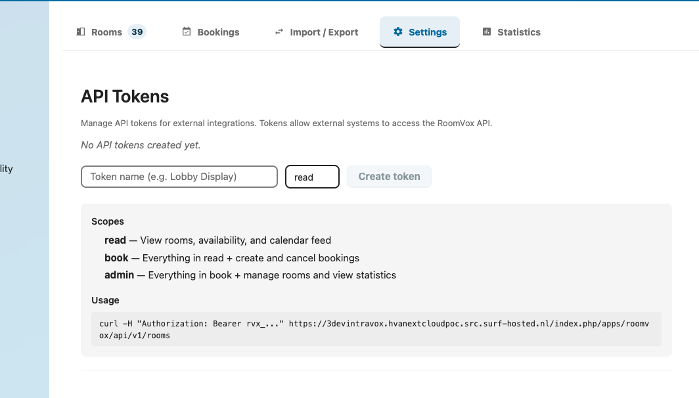

# Public API

RoomVox exposes a **Bearer-token authenticated** REST API at `/api/v1/*` for external integrations — digital signage, room displays, kiosks, scheduled imports, and third-party booking flows.

For the full endpoint reference, see [API Reference → Public API v1](../architecture/api-reference.md#public-api-v1).

## When to Use the Public API

| Use case | Why |
|---|---|
| Room displays / tablets outside meeting rooms | Show current and upcoming bookings; allow walk-in bookings |
| Lobby kiosks / digital signage | Display available rooms with capacity and facilities |
| Scheduled CSV imports | Periodic sync from an HR or facility-management system |
| Reservations from a third-party booking flow | Custom front-end backed by RoomVox as the booking engine |
| Statistics dashboards | Pull usage data for BI / reporting |
| Programmatic iCal feeds | Calendar sync for tools that support Bearer-authenticated CalDAV-like feeds |

## Creating an API Token



1. **Settings → Administration → RoomVox → Settings tab**
2. Scroll to **API Tokens**
3. Enter a token **name** (e.g., `Lobby Display`)
4. Choose a **scope**: `read`, `book`, or `admin`
5. Optional: restrict to specific rooms
6. Optional: set an expiration date
7. Click **Create token**
8. **Copy immediately** — the token is shown only once. After creation only the prefix (`rvx_xxxx...`) is shown

## Scopes

| Scope | Allows |
|---|---|
| `read` | List rooms, read bookings, read availability, read iCal feed |
| `book` | Above + create bookings |
| `admin` | Above + statistics + admin operations |

Tokens can be optionally restricted to specific rooms — useful for room-display deployments where one device only needs access to one room.

## Authentication

Every request includes a Bearer token in the `Authorization` header:

```
Authorization: Bearer rvx_abc123...
```

The header is case-insensitive (`bearer` works too). Tokens always start with `rvx_`.

### Error Responses

| Status | Meaning |
|---|---|
| 401 — `Missing or invalid Authorization header` | No header or wrong format |
| 401 — `Invalid or expired API token` | Token revoked or past its expiration |
| 403 — `Insufficient permissions` | Token scope too low, or restricted token tried to access a different room |

## Common Endpoints

| Method | URL | Scope | Purpose |
|---|---|---|---|
| `GET` | `/api/v1/rooms` | `read` | List all rooms (filtered by token's room restriction) |
| `GET` | `/api/v1/rooms/{id}` | `read` | Get room details |
| `GET` | `/api/v1/rooms/{id}/status` | `read` | Current status — Available / Reserved with end time |
| `GET` | `/api/v1/rooms/{id}/availability` | `read` | Availability for a date range |
| `GET` | `/api/v1/rooms/{id}/bookings` | `read` | List bookings for a room |
| `POST` | `/api/v1/rooms/{id}/bookings` | `book` | Create a booking |
| `DELETE` | `/api/v1/rooms/{id}/bookings/{uid}` | `book` | Cancel a booking (optional `?recurrenceId=` for single occurrence) |
| `GET` | `/api/v1/rooms/{id}/calendar.ics` | `read` | iCalendar feed |
| `GET` | `/api/v1/statistics` | `admin` | Usage statistics |

Full request/response schemas, examples, and error formats: [API Reference → Public API v1](../architecture/api-reference.md#public-api-v1).

## Quick Example: Lobby Display

A typical room-display deployment showing current and upcoming bookings:

```bash
# Get current status
curl -H "Authorization: Bearer rvx_abc..." \
  https://nextcloud.example.com/apps/roomvox/api/v1/rooms/boardroom/status
```

Response:

```json
{
  "id": "boardroom",
  "name": "Boardroom",
  "status": "available",
  "nextBooking": {
    "uid": "abc-123",
    "summary": "Quarterly review",
    "start": "2026-06-02T14:00:00+02:00",
    "end": "2026-06-02T15:30:00+02:00",
    "organizer": "alice@example.com"
  }
}
```

```bash
# Get next 24 hours of bookings
curl -H "Authorization: Bearer rvx_abc..." \
  "https://nextcloud.example.com/apps/roomvox/api/v1/rooms/boardroom/bookings?from=2026-06-02T00:00:00Z&to=2026-06-03T00:00:00Z"
```

## Quick Example: Walk-In Booking from a Tablet

A tablet outside a meeting room lets a passing user book the room for 30 minutes:

```bash
curl -X POST \
  -H "Authorization: Bearer rvx_abc..." \
  -H "Content-Type: application/json" \
  -d '{
    "summary": "Quick sync",
    "start": "2026-06-02T11:00:00+02:00",
    "end": "2026-06-02T11:30:00+02:00",
    "organizerEmail": "walkin@example.com"
  }' \
  https://nextcloud.example.com/apps/roomvox/api/v1/rooms/boardroom/bookings
```

Behavior is identical to a booking made from a calendar app:

- Auto-accept rooms confirm immediately
- Non-auto-accept rooms create a Tentative booking and notify managers
- API-created bookings on non-auto-accept rooms correctly trigger approval emails (fixed in v1.1.1, see [#14](https://github.com/nextcloud/RoomVox/issues/14))

## Rate Limits and Constraints

| Constraint | Limit |
|---|---|
| Date range parameters (`from`/`to`) | Max 365 days |
| CSV import file size | Max 5 MB |
| Token scope | Strictly enforced — `read` cannot create bookings |
| Token room restriction | Tokens restricted to specific rooms return 403 for other rooms |

## Security

- Tokens are **secrets** — treat them like passwords
- Tokens are **shown only once** at creation — store securely
- Tokens can be **revoked** any time from the Settings tab — revocation is immediate
- Set **expiration dates** on tokens used for short-lived integrations
- Use **room-restricted tokens** for displays/kiosks — limits blast radius if compromised
- Public API requests are logged with token prefix in `nextcloud.log`

## See Also

- [API Reference](../architecture/api-reference.md) — full endpoint documentation
- [Admin Settings → API Tokens](../admin/settings.md#api-tokens) — token management UI
- [Backend Architecture](../architecture/backend-architecture.md) — API token middleware
