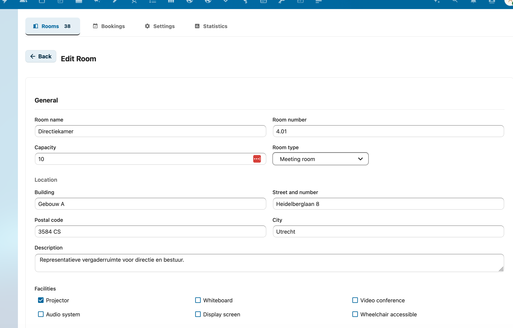

# Aan de slag met RoomVox

Deze gids helpt je RoomVox op te zetten en je eerste reserveerbare ruimte aan te maken, in een paar minuten.

## Vereisten

- Nextcloud 32 of 33
- PHP 8.2+
- SMTP geconfigureerd in Nextcloud (voor e-mailnotificaties)
- RoomVox-app geïnstalleerd (zie [Installatie-gids](deployment/installation.md))

## Stap 1: Open het admin-paneel

Navigeer naar **Instellingen → Beheer → RoomVox** in je Nextcloud-instantie.

Je ziet het RoomVox-admin-paneel met tabs voor Ruimtes, Boekingen, Import/Export, Instellingen en Statistieken.

## Stap 2: Configureer instellingen

Voor je ruimtes aanmaakt, bekijk de app-instellingen:

1. Klik op de tab **Instellingen**
2. Stel **Standaard auto-accept** in — of nieuwe ruimtes standaard boekingen automatisch accepteren
3. Schakel **E-mailnotificaties** in — booking-bevestiging en goedkeurings-e-mails
4. Configureer **Ruimte-typen** — voeg typen toe of pas aan (vergaderkamer, studio, collegezaal, etc.)
5. Bekijk **Telemetrie** — anonieme gebruiksdata is standaard aan ([details](admin/telemetry.md))

## Stap 3: Maak je eerste ruimte aan

1. Klik op de tab **Ruimtes**
2. Klik **+ Nieuwe ruimte**
3. Vul ruimte-details in:
   - **Naam** — bv. "Vergaderzaal 1" (verplicht)
   - **Ruimtenummer** — bv. "2.17" voor verdieping 2, kamer 17
   - **Capaciteit** — maximaal aantal personen
   - **Ruimte-type** — selecteer uit je geconfigureerde typen
   - **Adres** — gebouw, straat en stad
   - **Faciliteiten** — vink toepasbare opties aan (beamer, whiteboard, videovergaderen, etc.)
4. Configureer boekingsgedrag:
   - **Auto-accept** — boekingen automatisch bevestigen, of manager-goedkeuring vereisen
   - **Beschikbaarheidsregels** — optioneel beperken tot specifieke dagen en tijden
   - **Boekingshorizon** — optioneel beperken hoe ver vooraf geboekt kan worden
5. Klik **Ruimte aanmaken**

De ruimte is nu beschikbaar als CalDAV-resource in kalender-apps.

## Stap 4: Stel permissies in

!!! warning "Standaard kan iedereen boeken"
    RoomVox gebruikt een eigen permissie-systeem, los van Nextcloud Calendar-sharing. **Zonder RoomVox-permissies kunnen alle geauthenticeerde gebruikers alle ruimtes boeken**. Wil je dit beperken, stel permissies hier in.

1. In de ruimte-lijst, klik op het **permissies-icoon**
2. Voeg gebruikers of groepen toe met passende rol:
   - **Viewer** — kan de ruimte zien in kalender-apps
   - **Booker** — kan de ruimte boeken
   - **Manager** — kan boekingen goedkeuren/afwijzen en de ruimte beheren
3. Klik **Opslaan**

**Tip**: gebruik Nextcloud-groepen (bv. "staff", "studenten") in plaats van individuele gebruikers. Zie [Permissies](admin/permissions.md) voor details.

## Stap 5: Boek een ruimte

### Vanuit Nextcloud Calendar

1. Maak een nieuwe kalender-afspraak
2. In de afspraak-editor, zoek de **Resources**-sectie
3. Zoek je ruimte op naam
4. Voeg de ruimte aan de afspraak toe
5. Sla de afspraak op

De ruimte reageert met:

- **Geaccepteerd** — als auto-accept aan staat en geen conflicten
- **Voorlopig** — als manager-goedkeuring vereist is
- **Afgewezen** — bij een scheduling-conflict

### Vanuit andere kalender-apps

Ruimtes verschijnen als CalDAV-resources in elke compatibele kalender-app:

- **Apple Calendar** — ruimtes verschijnen in de resource-picker bij afspraken maken
- **Microsoft Outlook** — toevoegen via CalDAV-account, ruimtes verschijnen als resources
- **Thunderbird** — ruimtes beschikbaar via CalDAV resource-support
- **eM Client** — ruimtes automatisch gedetecteerd via LOCATION-veld

## Stap 6: Beheer boekingen

1. Ga naar de **Boekingen**-tab in het admin-paneel
2. Filter op ruimte, status of datum
3. Voor wachtende boekingen (voorlopig), klik **Goedkeuren** of **Afwijzen**
4. Goedgekeurde boekingen versturen bevestigings-e-mails naar de organisator

## Stap 7: API-tokens opzetten (optioneel)

Wil je integreren met externe systemen (ruimte-displays, kiosken, digital signage)? Maak een API-token aan:

1. Ga naar de **Instellingen**-tab
2. Scroll naar **API-tokens**
3. Voer een naam in (bv. "Lobby Display") en selecteer een scope (`read`, `book` of `admin`)
4. Klik **Token aanmaken**
5. Kopieer het gegenereerde token meteen — het wordt niet opnieuw getoond

Zie de [API-referentie](architecture/api-reference.md) voor endpoint-documentatie en gebruikvoorbeelden.

## Volgende stappen

- [Ruimtebeheer](admin/room-management.md) — Geavanceerde ruimte-configuratie
- [Import / Export](admin/import-export.md) — Bulk-ruimtebeheer via CSV
- [Permissies](admin/permissions.md) — Gedetailleerde permissie-setup
- [E-mailconfiguratie](admin/email-configuration.md) — Per-ruimte SMTP configureren
- [API-referentie](architecture/api-reference.md) — Publieke API voor externe integraties
- [Calendar-patch](features/calendar-patch.md) — Installeer de visuele ruimte-browser voor Nextcloud Calendar
