# RoomVox Documentation

Welcome to the RoomVox documentation. RoomVox is a CalDAV-native room booking app for Nextcloud that lets users book meeting rooms directly from any calendar app.

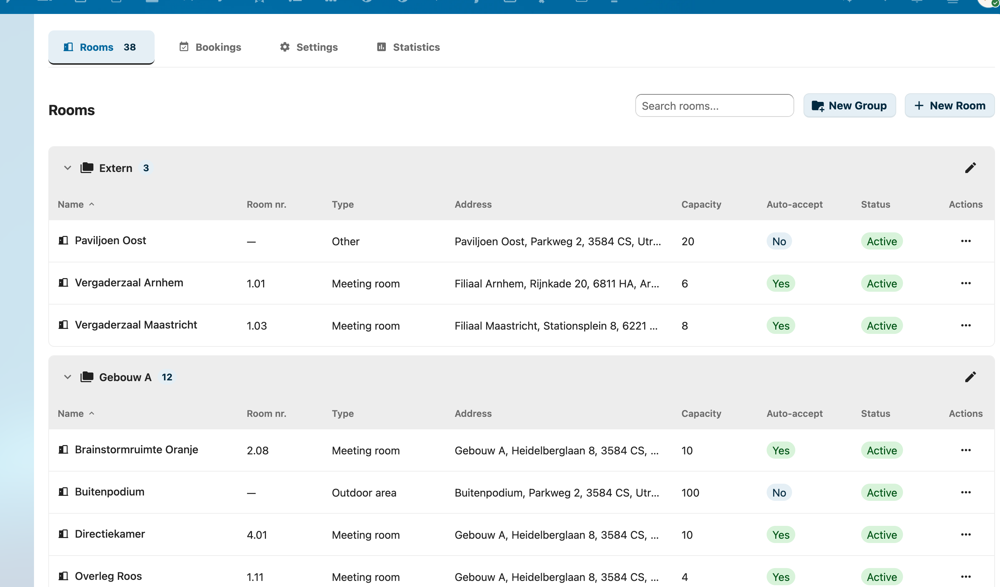

## Quick Navigation

### For Users
Learn how to book rooms, manage bookings, and understand notifications.

- [Booking Rooms](user/booking-rooms.md) — How to book rooms from calendar apps
- [Managing Bookings](user/managing-bookings.md) — Approve, decline, reschedule, and cancel bookings
- [Notifications](user/notifications.md) — Email notifications explained

### For Administrators
Installation, configuration, and room management.

- [Installation](admin/installation.md) — Requirements and installation guide
- [Room Management](admin/room-management.md) — Creating rooms, types, and groups
- [Permissions](admin/permissions.md) — Viewer, Booker, and Manager roles
- [Email Configuration](admin/email-configuration.md) — SMTP setup and per-room email
- [Import / Export](admin/import-export.md) — CSV import/export and MS365 migration
- [Calendar Patch](admin/calendar-patch.md) — Visual room browser for Nextcloud Calendar
- [Telemetry](admin/telemetry.md) — Anonymous usage data collection (opt-out)

### For Developers
Technical documentation and API reference.

- [Architecture Overview](architecture/overview.md) — CalDAV backend, scheduling, data storage
- [API Reference](architecture/api-reference.md) — Internal and Public REST API with examples

### Comparison

- [RoomVox vs Calendar Resource Management](comparison.md) — Feature comparison with Nextcloud's built-in resource app

### Troubleshooting

- [Troubleshooting](troubleshooting.md) — Common issues and solutions

## Getting Started

New to RoomVox? Start with our [Getting Started Guide](getting-started.md) to set up your first room in minutes.

## Screenshots

| Screenshot | Description |
|------------|-------------|
|  | Room overview with groups |
|  | Room editor |
| 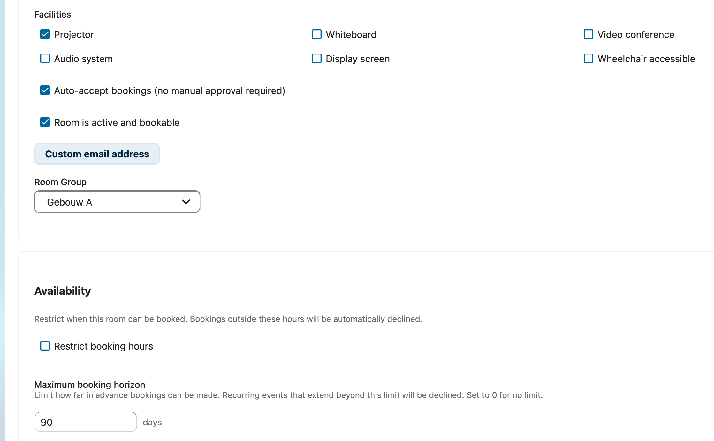 | Room settings: facilities, availability, booking horizon |
| 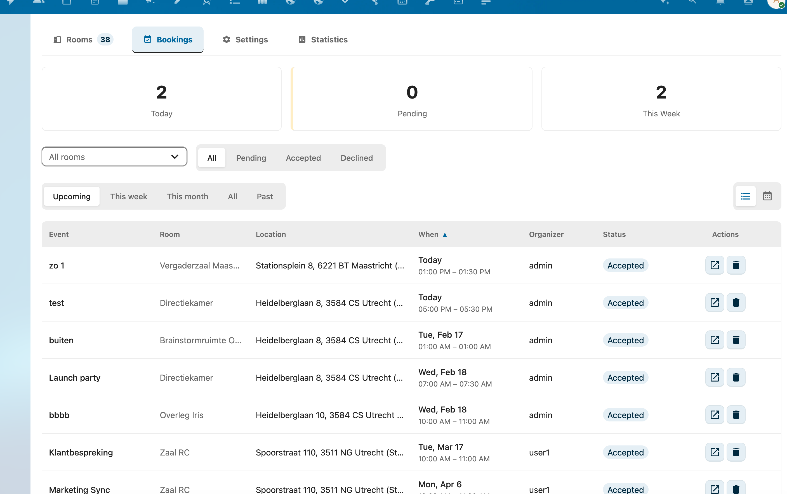 | Booking overview with filters |
| 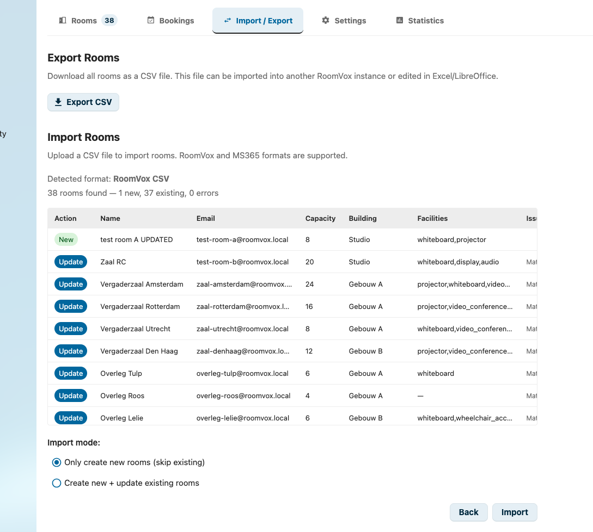 | CSV import preview |
| 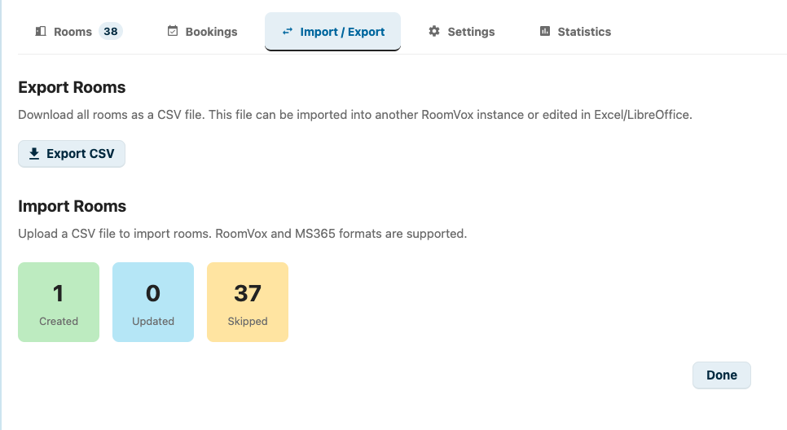 | CSV import results |
| 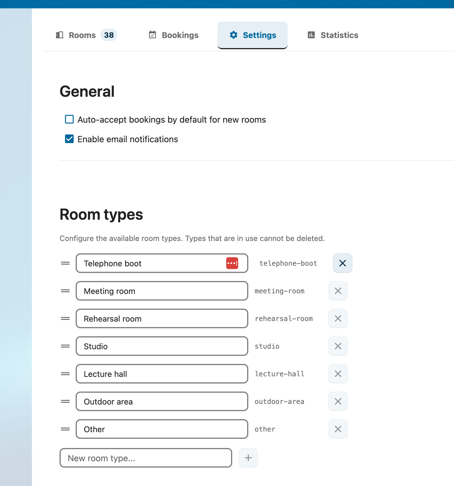 | Global settings and room types |
| 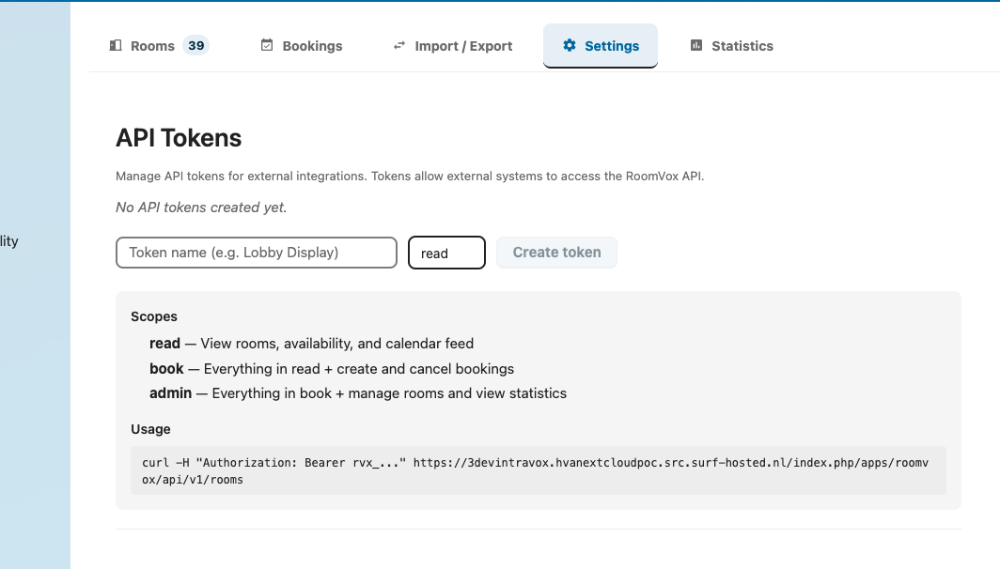 | API token management |
| 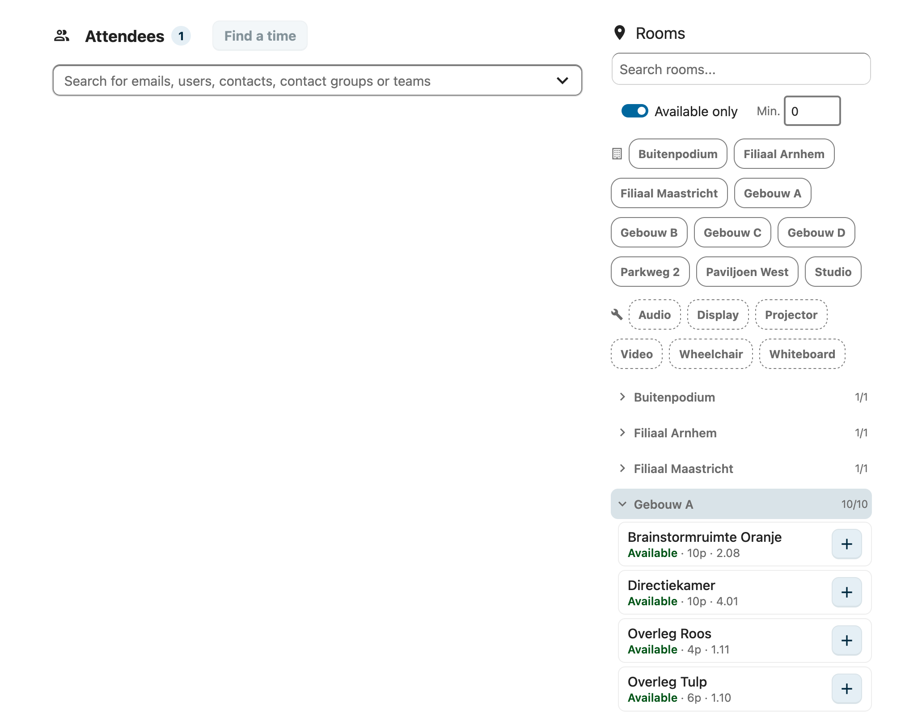 | Visual room browser (calendar patch) |
| 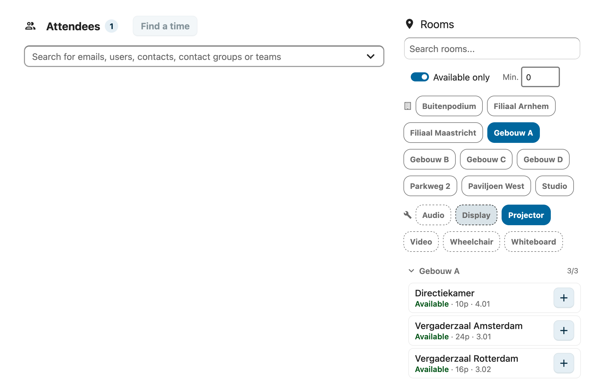 | Room browser: filter by building and facilities |
| 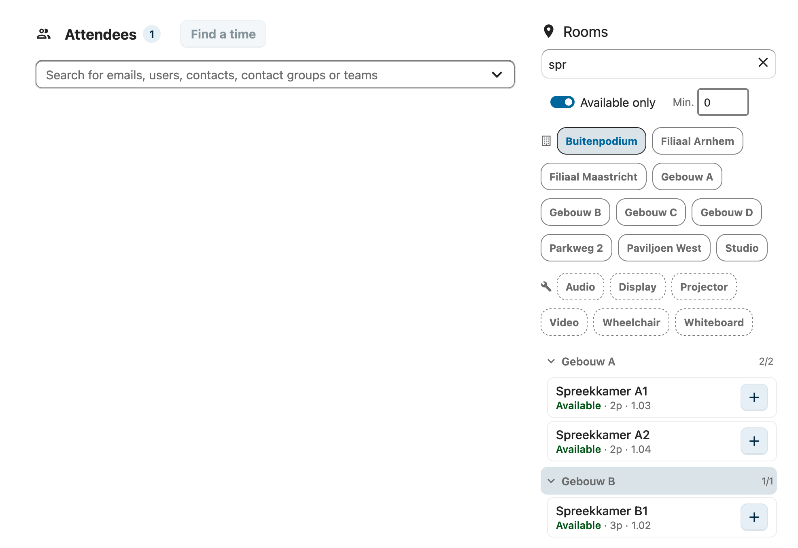 | Room browser: search by name |
| 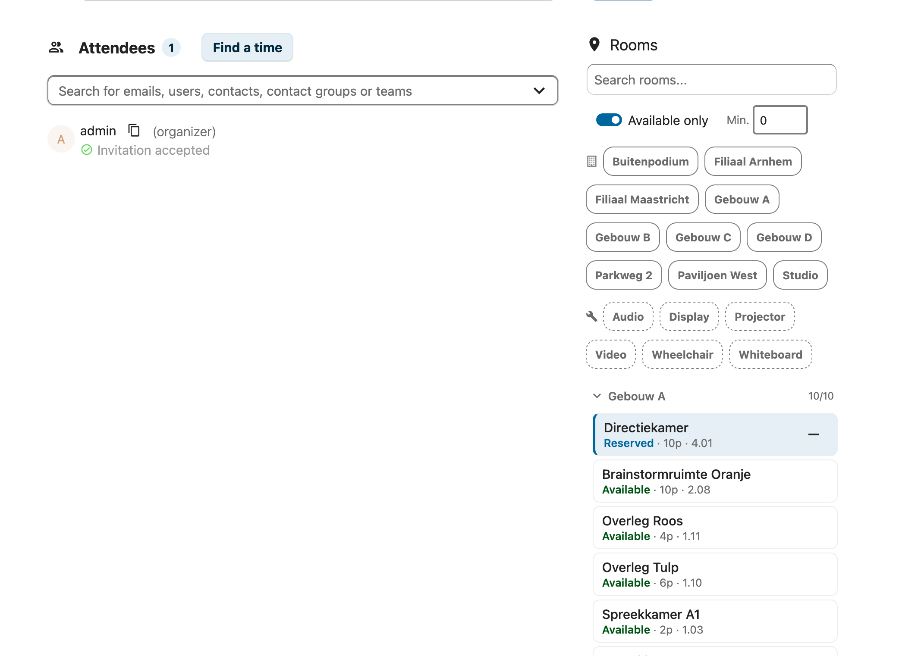 | Room browser: room selected |
| 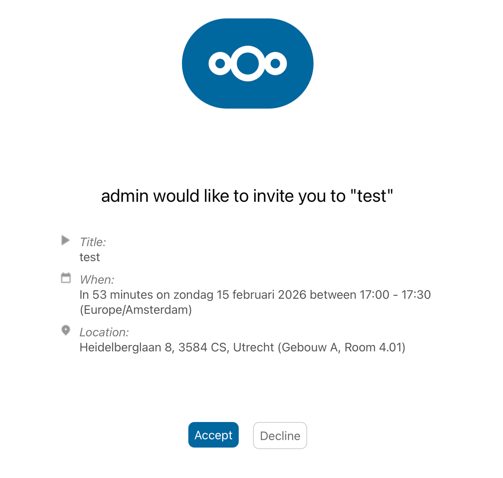 | Booking confirmation email |

## Support

- **Issues & Feature Requests:** [Gitea Issues](https://gitea.rikdekker.nl/sam/RoomVox/issues)
- **Source Code:** [Gitea Repository](https://gitea.rikdekker.nl/sam/RoomVox) | [GitHub Mirror](https://github.com/nextcloud/roomvox)

## License

RoomVox is licensed under the [AGPL-3.0 License](https://www.gnu.org/licenses/agpl-3.0.html).
