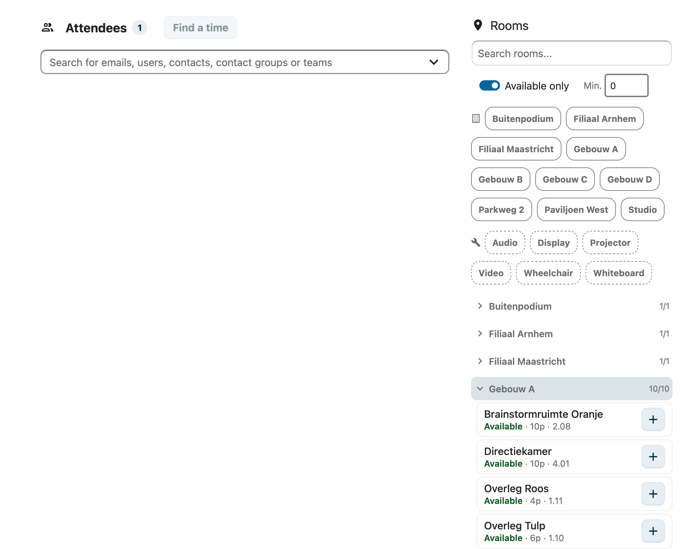
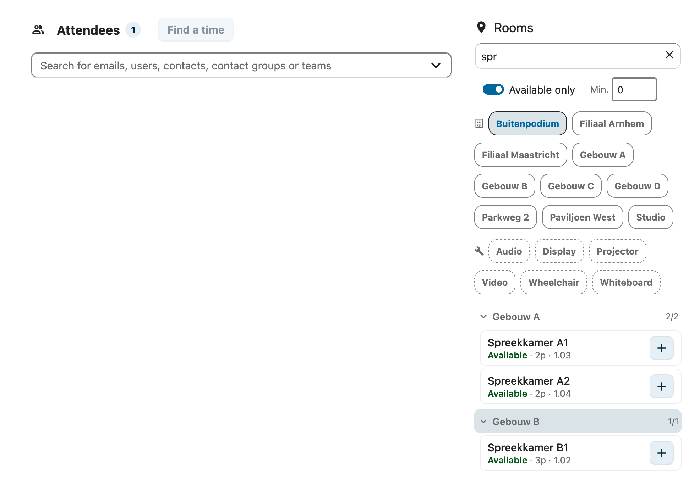
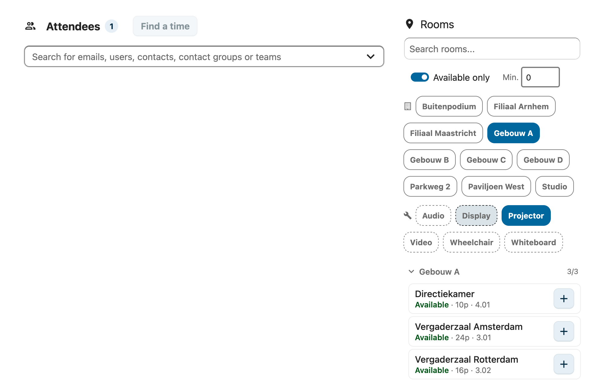
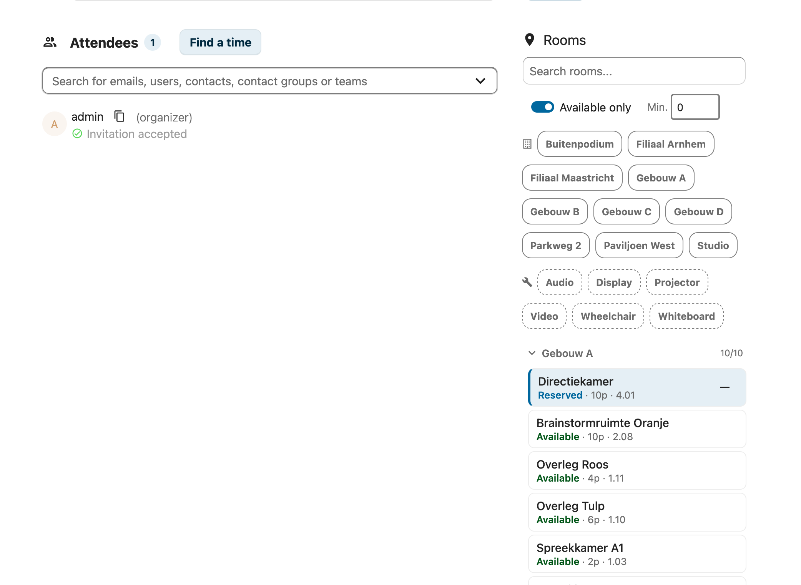

# Ruimtes boeken

RoomVox maakt ruimtes beschikbaar als standaard CalDAV-resources. Dit betekent dat je ruimtes direct kunt boeken vanuit elke agenda-app die CalDAV-resources ondersteunt — geen aparte boekings-interface nodig.

## Hoe het werkt

Wanneer een beheerder een ruimte aanmaakt in RoomVox, wordt deze beschikbaar als CalDAV-resource. Wanneer je deze resource aan een agenda-event toevoegt, doet RoomVox automatisch:

1. Checkt je **permissie** om de ruimte te boeken
2. Verifieert of de ruimte **beschikbaar** is op het gevraagde tijdstip
3. Checkt tegen **beschikbaarheids-regels** (toegestane dagen/tijden)
4. Checkt de **boekings-horizon** (maximum vooruit-boekings-periode)
5. Of **accepteert automatisch** de boeking, of markeert hem als **voorlopig** (in afwachting van manager-goedkeuring)
6. Stuurt **e-mail-notificaties** naar de organisator en managers

## Boeken vanuit Nextcloud Calendar

### Standaard-resource-picker

1. Maak een nieuw event aan of bewerk een bestaande
2. Vind in de event-editor de sectie **Resources**
3. Begin de ruimte-naam te typen in het zoekveld
4. Selecteer de ruimte uit de resultaten
5. De ruimte toont capaciteit en adres in de dropdown
6. Sla het event op

### Visuele ruimte-browser (calendar-patch)

Als je beheerder de [calendar-patch](../features/calendar-patch.md) heeft geïnstalleerd, zie je een uitgebreide ruimte-browser in plaats van de standaard-picker:

- **Blader door alle ruimtes** gegroepeerd per gebouw
- **Filter** op beschikbaarheid, capaciteit, gebouw en faciliteiten
- **Zoek** op naam, gebouw, adres of verdieping
- **Ruimte-kaarten** tonen status (beschikbaar/onbeschikbaar), capaciteit en verdieping
- Klik op **+** om een ruimte toe te voegen, **-** om hem te verwijderen

#### Ruimtes zoeken

Typ in het zoekveld om ruimtes te filteren op naam, gebouw, adres of verdiepings-nummer. Resultaten updaten direct tijdens het typen.

#### Filteren op gebouw en faciliteiten

Klik op de gebouw- of faciliteit-chips om ruimtes te filteren. Meerdere filters kunnen gecombineerd worden — selecteer bijvoorbeeld een gebouw en een faciliteit om alle ruimtes in dat gebouw met een beamer te vinden.

#### Een ruimte toevoegen

Klik op de **+**-knop op een ruimte-kaart om hem aan je event toe te voegen. De ruimte verschijnt als "Gereserveerd" (blauw) en het LOCATION-veld wordt automatisch ingevuld.

## Boeken vanuit Apple Calendar

Apple Calendar (macOS en iOS) ondersteunt CalDAV-resources native.

### macOS

1. Maak een nieuw event aan
2. Klik op **Add Location, Video Call, or Travel Time**
3. Zoek in de deelnemers-sectie naar de ruimte-naam
4. Selecteer de ruimte-resource
5. Sla het event op

### iOS

1. Maak een nieuw event aan
2. Tik op **Genodigden**
3. Zoek naar de ruimte-naam
4. Voeg de ruimte toe
5. Sla het event op

> **Let op:** iOS verstuurt ruimte-deelnemers met `CUTYPE=INDIVIDUAL` in plaats van `CUTYPE=ROOM`. RoomVox detecteert en fixt dit automatisch.

## Boeken vanuit Microsoft Outlook

Outlook ondersteunt CalDAV-resources wanneer verbonden via een CalDAV-account.

1. Maak een nieuwe vergadering aan
2. Voeg de ruimte toe als deelnemer in de scheduling-assistant
3. De ruimte reageert met zijn beschikbaarheid
4. Verstuur de vergader-uitnodiging

## Boeken vanuit Thunderbird

Thunderbird ondersteunt CalDAV-resources via de agenda-integratie.

1. Maak een nieuw event aan
2. Voeg de ruimte toe als deelnemer in de deelnemers-lijst
3. De ruimte-naam moet matchen met de CalDAV-resource-naam
4. Sla het event op

## Boeken vanuit eM Client

eM Client heeft speciale afhandeling voor ruimtes:

1. Maak een nieuw event aan
2. Stel het **Locatie**-veld in op de ruimte-naam
3. RoomVox detecteert de ruimte via locatie-match en voegt hem automatisch toe als deelnemer
4. Sla het event op

> **Let op:** eM Client stuurt mogelijk geen ruimte-deelnemer expliciet. De scheduling-plugin van RoomVox detecteert de ruimte door het LOCATION-veld te matchen tegen bekende ruimte-namen.

## Boekings-responses

Nadat je een ruimte aan je event hebt toegevoegd, reageert de ruimte met een van deze statussen:

| Status | Betekenis |
|--------|-----------|
| **Geaccepteerd** | Ruimte is geboekt en bevestigd |
| **Voorlopig** | Boeking vereist manager-goedkeuring (in afwachting) |
| **Afgewezen** | Boeking is afgewezen |

### Waarom een boeking afgewezen kan worden

- **Planning-conflict** — een ander event is al geboekt op dat tijdstip. Je ontvangt een e-mail over het conflict.
- **Geen permissie** — je hebt geen Booker- of Manager-rol voor de ruimte. Je ontvangt een "Boeking niet toegestaan"-e-mail. De ruimte wordt automatisch uit je event verwijderd en de locatie gewist.
- **Buiten beschikbaarheid** — het gevraagde tijdstip valt buiten de beschikbare uren van de ruimte
- **Voorbij boekings-horizon** — het event is te ver in de toekomst
- **Delivery-error** — een server-side issue voorkwam de boeking

## Conflict-detectie

RoomVox checkt automatisch op planning-conflicten:

- Als een ruimte al geboekt is op het gevraagde tijdstip, wordt de boeking afgewezen
- Geannuleerde en afgewezen boekingen worden genegeerd tijdens conflict-checking
- Bij verplaatsen wordt de bestaande boeking uitgesloten van de conflict-check

## Terugkerende events

RoomVox ondersteunt terugkerende events met enkele overwegingen:

- **Beschikbaarheids-regels** gelden voor elke voorkomende keer
- **Boekings-horizon** wordt gecheckt tegen de verste voorkomende keer (op basis van RRULE UNTIL of COUNT)
- **Oneindige terugkerende events** (geen UNTIL of COUNT) worden altijd afgewezen wanneer een boekings-horizon is ingesteld
- **Conflict-checking** geldt voor de initiële boeking; conflicten in individuele voorkomende keren moeten mogelijk handmatig worden opgelost
