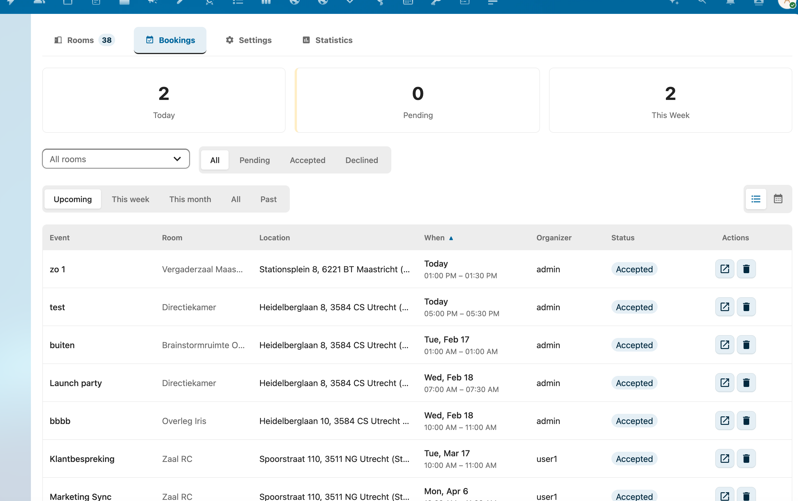

# Managing Bookings

This guide covers how to view, approve, decline, reschedule, and cancel bookings in RoomVox.

## Booking Overview

The **Bookings** tab shows all bookings across rooms. It is available in two places:

- **Admins**: Settings → Administration → RoomVox → Bookings
- **Managers**: Settings → Personal → RoomVox → Bookings (third tab, only appears if you manage at least one room). Scoped to the rooms you manage, so you don't see bookings for rooms outside your responsibility.

Both views share the same component — stats cards, filters, list/calendar toggle, drag-and-drop move-between-rooms, and the Cancel-booking flow.

### Recurring Events

Recurring bookings (e.g., weekly meetings) are displayed as individual occurrences in the overview. Each occurrence can be managed independently — you can approve, decline, or cancel specific dates within a series.

Conflict checking respects RRULE: booking the same room on the second (or any later) occurrence of an existing weekly series is now correctly flagged as a conflict, not only the first occurrence.

### Filtering Bookings

Use the filters at the top to narrow down the booking list:

- **Room** — select a specific room or view all rooms
- **Status** — filter by All, Pending, Accepted, or Declined
- **Date range** — set a start and end date (recurring events are expanded within this range)

### Booking Information

Each booking shows:

| Field | Description |
|-------|-------------|
| Event | The event title/summary |
| Room | Which room is booked |
| Location | Room address |
| When | Start and end date/time |
| Organizer | Who created the booking |
| Status | Accepted, Tentative (pending), or Declined |

## Approving Bookings

When a room has auto-accept disabled, bookings arrive with **Tentative** (pending) status and require manager approval.

### How to Approve

1. Go to **Bookings** tab
2. Filter by **Status: Pending** to see bookings awaiting approval
3. Click the **Approve** button (checkmark) on the booking
4. The booking status changes to **Accepted**
5. The organizer receives a confirmation email

### How to Decline

1. Go to **Bookings** tab
2. Find the pending booking
3. Click the **Decline** button (X) on the booking
4. The booking status changes to **Declined**
5. The organizer receives a decline notification email

## Creating Bookings

Managers can create bookings directly from the admin panel:

1. Navigate to the room's booking list
2. Click **Create booking**
3. Fill in:
   - **Summary** — event title (required)
   - **Start** — start date and time (required)
   - **End** — end date and time (required)
   - **Description** — optional details
4. Click **Save**

The booking is created with the current user as organizer. Conflict checking applies.

## Rescheduling Bookings

Bookings can be rescheduled to a different time or moved to a different room.

### Changing the Time

1. Find the booking in the Bookings tab
2. Click **Edit**
3. Update the start and/or end time
4. Click **Save**

Conflict checking is performed against the new time (excluding the current booking).

### Moving to a Different Room

There are two ways to move a booking to another room:

**Via the edit dialog (list view):**

1. Find the booking in the Bookings tab
2. Click **Edit**
3. Select a different room
4. Click **Save**

**Via drag-and-drop (calendar view):**

1. Toggle to the Calendar view (icon in the top-right of the Bookings tab)
2. Drag a booking to a different room column or a different time slot
3. The conflict check runs automatically and the move is rejected if the target slot is taken

In both cases, the booking is deleted from the original room and created in the new room with a new UID. The booker is not re-notified — they keep the same event in their own calendar; only the room attendee changes.

## Cancelling Bookings

### Who Can Cancel

- **The organizer** — the user who created the booking
- **Room managers** — users with Manager role for the room
- **Nextcloud admins** — always have full access

### How to Cancel

1. Find the booking in the Bookings tab
2. Click the **Cancel booking** button (trash icon)
3. Confirm in the dialog (Keep booking / Cancel booking)
4. The booking is removed from the room calendar
5. The booker is notified by email that the booking was cancelled by a room manager
6. The room is also removed from the booker's own calendar event (LOCATION is cleared and the room attendee is dropped), so the slot frees up in the Room Finder

### Cancelling from Calendar Apps

Users can also cancel bookings by:

1. Opening the event in their calendar app
2. Removing the room resource from the event
3. Saving the event

RoomVox receives a CANCEL iTIP message and removes the booking from the room calendar.

## Booking Statuses

| Status | CalDAV PARTSTAT | Description |
|--------|----------------|-------------|
| Accepted | `ACCEPTED` | Room is confirmed for this event |
| Pending | `TENTATIVE` | Waiting for manager approval |
| Declined | `DECLINED` | Booking was rejected (conflict, permission, etc.) |
| Cancelled | Event deleted | Booking was cancelled by organizer or manager |

## Permission Requirements

| Action | Required Role |
|--------|--------------|
| View bookings | Manager or Admin |
| Approve/decline | Manager or Admin |
| Create booking | Booker, Manager, or Admin |
| Reschedule booking | Organizer, Manager, or Admin |
| Cancel booking | Organizer, Manager, or Admin |
| View all bookings overview | Any authenticated user (filtered by visible rooms) |
